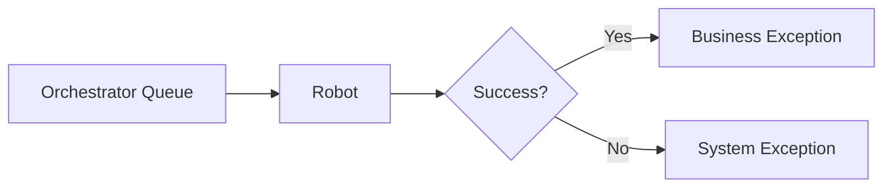

# UIPath Knowledge Base - GitHub Copilot Instructions

Diese Datei definiert das Vorgehen, Prüfkriterien und Best Practices für alle Interaktionen mit der UIPath Knowledge Base.

---

## 🎯 Hauptziele

1. **Konsistenz**: Einheitliche Dokumentation über alle Bereiche
2. **Qualität**: Hochwertige, validierte und geprüfte Inhalte
3. **Nachvollziehbarkeit**: Alle wichtigen Entscheidungen dokumentieren (ADR)
4. **Wiederverwendbarkeit**: Templates und Patterns für häufige Aufgaben

---

## 📁 Projekt-Struktur

```
uipath-kb/
├── .github/
│   └── copilot-instructions.md          # Diese Datei
├── mcp-servers/                         # MCP Server Implementierungen
│   ├── uipath-docs/                     # UIPath Docs Server
│   ├── youtube-scraper/                 # YouTube Scraper mit Whisper
│   ├── local-knowledge/                 # Lokale Dokumentationssuche
│   └── reddit-search/                   # r/UiPath Community Search
├── knowledge/                           # Zentrale Knowledge Base
│   ├── usecases/                        # Use Cases (Business + Analyse)
│   │   └── uc-XXX-name/                 # Pro Use Case ein Ordner
│   │       ├── README.md                # Business-Input (vom User)
│   │       ├── analysis.md              # Technische Analyse (von Copilot)
│   │       └── assets/                  # Zusätzliche Dateien
│   ├── official/                        # Gecachte UIPath Docs
│   ├── videos/                          # Video Transkripte & Metadaten
│   ├── reddit/                          # Reddit Community Insights
│   ├── custom/                          # Eigene Best Practices & Referenzen
│   └── generated/                       # Generierte Dokumente
├── docs/                                # Projekt-Dokumentation
│   ├── adr/                             # Architecture Decision Records
│   ├── usecase-workflow.md              # Use Case Dokumentations-Workflow
│   ├── guides/                          # Leitfäden und Tutorials
│   └── reference/                       # Referenz-Dokumentation
├── scripts/                             # Utility-Scripts
│   ├── transcribe-video.py              # Whisper Transcription
│   ├── batch-transcribe.py              # Batch Processing
│   └── monitor-reddit.py                # Reddit Monitoring
├── templates/                           # Dokumentations-Templates
│   ├── architecture/                    # Architektur-Templates
│   └── concepts/                        # Konzept-Templates
└── validators/                          # Validierungs-Tools
```

---

## 🔄 Workflow für neue Requests

### 0. Use Case Dokumentation (Primärer Workflow)

**Für Business-Use-Cases:**

Siehe **[Use Case Workflow](../docs/usecase-workflow.md)** für den vollständigen Prozess:

```
1. User legt Use Case in knowledge/usecases/uc-XXX-name/README.md ab
2. (Optional) User legt bestehende UiPath-Solution in assets/uipath-solution/ ab
3. User beauftragt: "Analysiere bitte UC-XXX technisch"
4. Copilot:
   - README.md analysieren (Lücken identifizieren)
   - Falls vorhanden: assets/uipath-solution/ prüfen und Code analysieren
     * Workflows untersuchen (Main.xaml, Subfolder)
     * Best Practices checken (Exception Handling, Config, Logging)
     * Verbesserungspotenziale identifizieren
     * Wiederverwendbare Komponenten markieren
   - MCP-Server Recherche (UIPath Docs, Reddit, Videos, Local KB)
   - analysis.md erstellen (im selben UC-Ordner)
   - Rückfragen formulieren (Kritisch/Wichtig/Nice-to-have)
   - Vorläufige Architektur skizzieren (inkl. Bestandscode-Integration)
```

**Output:** `knowledge/usecases/uc-XXX-name/analysis.md` mit:
- � Bestandscode-Analyse (falls Solution-Files vorhanden)
- �🔴 Offene Rückfragen (priorisiert)
- Vorläufige Architektur (Mermaid)
- Risiko-Assessment
- MVP-Empfehlung

**Dieser Workflow hat PRIORITÄT** bei allen Use-Case-bezogenen Requests!

### 1. Request-Analyse (Allgemein)

**IMMER zuerst:**
```
1. Request-Typ identifizieren:
   - [ ] Use Case technisch dokumentieren (→ usecase-workflow.md)
   - [ ] Dokumentation erstellen
   - [ ] Architektur entwickeln
   - [ ] Konzept dokumentieren
   - [ ] Video scrapen
   - [ ] Suche/Recherche
   - [ ] MCP-Server erweitern

2. Knowledge Base durchsuchen:
   - [ ] Existiert bereits ähnliche Dokumentation?
   - [ ] Gibt es relevante ADRs?
   - [ ] Welche Templates passen?

3. ADR prüfen:
   - [ ] Relevante Architecture Decision Records lesen
   - [ ] Etablierte Patterns verwenden
   - [ ] Bei Abweichungen neuen ADR erstellen
```

### 2. Recherche durchführen

**Für UIPath-Themen:**
```typescript
// 1. Offizielle Docs durchsuchen
await mcp.uipath_docs_search({ query: "thema" });

// 2. Lokale Knowledge Base prüfen
await mcp.knowledge_search({ 
  query: "thema", 
  category: "all" 
});

// 3. Bei Videos: YouTube scrapen
await mcp.youtube_extract_wisdom({ 
  url: "video-url" 
});
```

### 3. Dokumentation erstellen

**IMMER diese Schritte befolgen:**

```bash
# 1. Passende Template wählen
templates/architecture/architecture-template.md
templates/concepts/concept-template.md

# 2. Generator verwenden (falls zutreffend)
node validators/generate-architecture.js requirements.json
node validators/generate-concept.js concept-input.json

# 3. Dokument manuell vervollständigen
# - Alle [Platzhalter] ersetzen
# - Metadaten hinzufügen
# - Referenzen verlinken

# 4. Validieren
node validators/validate-documentation.js dokument.md

# 5. In /docs ablegen
mv dokument.md docs/
```

### 4. ADR für wichtige Entscheidungen

**ADR erstellen wenn:**
- ✅ Neue Architektur-Pattern eingeführt wird
- ✅ Technologie-Entscheidung getroffen wird
- ✅ Prozess oder Workflow geändert wird
- ✅ Breaking Changes an MCP-Servern
- ✅ Neue Template-Struktur definiert wird

**ADR-Prozess:**
```bash
# 1. ADR aus Template erstellen
cp docs/adr/template.md docs/adr/NNNN-titel.md

# 2. ADR ausfüllen
# - Context beschreiben
# - Optionen evaluieren
# - Entscheidung dokumentieren
# - Konsequenzen aufzeigen

# 3. ADR in Index eintragen
# docs/adr/README.md aktualisieren

# 4. Bei neuem Code: ADR referenzieren
# Im Code-Kommentar oder Commit-Message
```

---

## ✅ Prüfkriterien

### Vor jedem Commit

- [ ] **Dokumentation vollständig**
  - Keine [Platzhalter] mehr vorhanden
  - Alle Sections ausgefüllt
  - Metadaten (Autor, Datum, Version) gesetzt

- [ ] **Validierung durchgeführt**
  - `node validators/validate-documentation.js` ausgeführt
  - Score ≥ 80/100
  - Alle Errors behoben
  - Kritische Warnings adressiert

- [ ] **Referenzen gesetzt**
  - Links zu UIPath Docs
  - Verweise auf relevante ADRs
  - Interne Verlinkungen korrekt

- [ ] **Strukturelle Anforderungen**
  - Dokument im richtigen Verzeichnis (/docs)
  - Dateiname folgt Konvention (kebab-case)
  - Tags/Kategorien gesetzt

- [ ] **Code-Qualität (bei MCP-Server Änderungen)**
  - TypeScript kompiliert ohne Fehler
  - npm run build erfolgreich
  - Server startet und reagiert auf tools/list
  - Error Handling implementiert

### Dokumentations-Qualität

**Minimum-Standards:**
- **Struktur**: Klare Gliederung mit Überschriften
- **Inhalt**: Mindestens 200 Wörter substantieller Content
- **Code-Beispiele**: Bei technischen Docs vorhanden
- **Diagramme**: Bei Architektur/Prozess-Docs vorhanden
- **Metadaten**: Vollständig ausgefüllt
- **Tags**: Mindestens 3 relevante Tags

**Best Practice:**
- Executive Summary für lange Dokumente
- Inhaltsverzeichnis bei > 500 Zeilen
- Visuelle Elemente (Diagramme, Tabellen)
- Praxisbeispiele und Use Cases
- Troubleshooting-Section

---

## 📝 Dokumentations-Standards

### Dateinamen-Konventionen

```
✅ Gut:
- architecture-invoice-processing.md
- concept-reframework-patterns.md
- guide-youtube-scraping.md
- adr-0001-mcp-server-architecture.md

❌ Schlecht:
- Architecture.md
- UIPath_Concept.md
- doc1.md
- architecture-v2.md (keine Versionssuffixe)
- konzept-FINAL.md (keine Status-Suffixe)
- dokument-2025-12-02.md (keine Datums-Suffixe)
```

**Versionierung:**
- Git für Versionierung nutzen (nicht Dateinamen)
- Keine Suffixe wie `-v2`, `-FINAL`, `-kopie`
- Bei größeren Änderungen: Commit vor der Änderung
- Alte Versionen via `git log` und `git show` einsehen

### Metadaten-Block

**Jedes Dokument beginnt mit:**
```markdown
# Titel des Dokuments

**Erstellt:** YYYY-MM-DD  
**Version:** x.y  
**Autor:** Name  
**Status:** [Draft|Review|Approved|Deprecated]  
**Tags:** `tag1`, `tag2`, `tag3`

---

[Inhalt beginnt hier]
```

### Sections-Hierarchie

```markdown
# H1: Nur für Haupt-Titel
## H2: Hauptkapitel
### H3: Unterkapitel
#### H4: Detaillierte Sections

Nicht tiefer als H4 verschachteln!
```

### Code-Blöcke

```markdown
# Immer mit Sprache annotieren
```typescript
const example: string = "code";
```

# VB.NET für UIPath
```vb
Dim result As String = "UIPath"
```

# Shell-Befehle
```bash
npm run build
```
```

---

## 🏗️ Architecture Decision Records (ADR)

### ADR-Nummerierung

```
docs/adr/
├── README.md                    # ADR Index
├── template.md                  # ADR Template
├── 0001-mcp-server-choice.md
├── 0002-knowledge-structure.md
├── 0003-validation-framework.md
└── ...
```

### ADR-Status

- **Proposed**: Zur Diskussion vorgeschlagen
- **Accepted**: Entscheidung getroffen und implementiert
- **Superseded**: Durch neueren ADR ersetzt
- **Deprecated**: Nicht mehr empfohlen
- **Rejected**: Entscheidung abgelehnt

### ADR-Struktur (MADR Format)

```markdown
# [Kurzer Titel der Entscheidung]

**Status:** [Proposed|Accepted|Superseded|Deprecated|Rejected]  
**Datum:** YYYY-MM-DD  
**Entscheider:** [Namen]

## Context

[Was ist der Kontext? Welches Problem lösen wir?]

## Decision Drivers

- [Driver 1]
- [Driver 2]
- [Driver 3]

## Considered Options

- Option 1: [Beschreibung]
- Option 2: [Beschreibung]
- Option 3: [Beschreibung]

## Decision Outcome

**Gewählte Option**: "[Option X]"

### Positive Consequences

- [z.B., Verbesserung der Qualität]
- [z.B., Weniger Komplexität]

### Negative Consequences

- [z.B., Zusätzlicher Aufwand]
- [z.B., Lernkurve]

## Pros and Cons of the Options

### Option 1

- ✅ Gut, weil [Argument 1]
- ✅ Gut, weil [Argument 2]
- ❌ Schlecht, weil [Argument 1]

### Option 2

[analog]

## Links

- [Relevante Referenzen]
- [Verwandte ADRs]
```

---

## 🔍 MCP-Server Nutzung

### UIPath Docs Server

```typescript
// Suche in offizieller Dokumentation
await mcp.uipath_docs_search({
  query: "orchestrator queue management",
  product: "orchestrator"
});

// Vollständige Seite abrufen
await mcp.uipath_docs_fetch({
  url: "https://docs.uipath.com/...",
  use_cache: true
});

// Produkte auflisten
await mcp.uipath_docs_list_products();
```

### YouTube Scraper

```typescript
// Video-Metadaten
await mcp.youtube_get_metadata({
  url: "https://www.youtube.com/watch?v=..."
});

// Transkript extrahieren
await mcp.youtube_get_transcript({
  url: "...",
  language: "en"
});

// Insights mit fabric-ai
await mcp.youtube_extract_wisdom({
  url: "...",
  force_refresh: false
});

// Zusammenfassung
await mcp.youtube_summarize({
  url: "..."
});

// Gecachte Videos
await mcp.youtube_list_cached();
```

### Local Knowledge

```typescript
// Knowledge Base durchsuchen
await mcp.knowledge_search({
  query: "reframework patterns",
  category: "custom",
  limit: 10
});

// Dokument abrufen
await mcp.knowledge_get_document({
  path: "custom/best-practices.md"
});

// Dokumente auflisten
await mcp.knowledge_list_documents({
  category: "all"
});

// Neues Dokument hinzufügen
await mcp.knowledge_add_document({
  title: "New Concept",
  content: "...",
  tags: ["tag1", "tag2"]
});

// Index neu aufbauen
await mcp.knowledge_rebuild_index();
```

---

## 🎨 Content-Guidelines

### Schreibstil

- **Klar und präzise**: Kurze Sätze, aktive Sprache
- **Technisch korrekt**: Validierte Informationen
- **Praxisnah**: Beispiele aus echten Projekten
- **Konsistent**: Einheitliche Terminologie
- **Zielgruppengerecht**: 
  - *Entwickler*: Technische Details, Code-Beispiele
  - *Architekten*: Patterns, Best Practices, Trade-offs
  - *Business*: Use Cases, Prozesse, Nutzen

### Sprache

- **Deutsch**: Für Business-Dokumentation
- **Englisch**: Für technische Code-Kommentare
- **Gemischt**: Wenn sinnvoll (z.B. englische Fachbegriffe)

### Terminologie (einheitlich verwenden)

**UIPath-Spezifisch:**
| Korrekt | NICHT verwenden |
|---------|-----------------|
| REFramework | "RE Framework", "Robotic Enterprise Framework" |
| Orchestrator | "UiPath Orchestrator" (außer bei Verwechslungsgefahr) |
| Studio | "UiPath Studio" (außer bei Verwechslungsgefahr) |
| Queue Item | "Queue-Item", "QueueItem" |
| Transaction Item | "TransactionItem" |
| Data Service | "UiPath Data Service" |

**Allgemein:**
- Konsistente Schreibweise über alle Dokumente
- Glossar in knowledge/custom/ für projektspezifische Begriffe
- Bei Abkürzungen: Beim ersten Vorkommen ausschreiben

### Beispiele

```markdown
✅ Gut:
"Das REFramework ist ein bewährtes Pattern für Produktions-Prozesse.
Es bietet robustes Exception Handling und Transaction-Management."

❌ Schlecht:
"REFramework ist gut. Man sollte es nutzen."
```

### Code-Beispiele

```markdown
# Immer mit Sprache annotieren
```typescript
const example: string = "code";
```

# VB.NET für UIPath
```vb
Dim result As String = "UIPath"
```

# Shell-Befehle
```bash
npm run build
```
```

### Verlinkungen

```markdown
# Interne Links (relativ)
[Siehe ADR-001](../adr/0001-mcp-server-choice.md)

# Externe Links (absolute)
[UIPath Docs](https://docs.uipath.com)

# Anchor-Links
[Zur Sektion](#installation)
```

### Diagramme (Mermaid)

**Best Practices:**
- **Komplexität begrenzen**: Max. 10-15 Knoten pro Diagramm
- **Hierarchie nutzen**: Übersicht-Diagramm + Detail-Diagramme
- **Lesbarkeit**: Kurze Labels (max. 3-4 Wörter)
- **Konsistente Farben**: Gleiche Farbe = gleiche Bedeutung
- **Subgraphs**: Für logische Gruppierung verwenden

**Diagrammtypen:**
| Anwendungsfall | Diagrammtyp | Beispiel |
|----------------|-------------|----------|
| Prozessfluss | `flowchart LR/TB` | REFramework States |
| Architektur | `flowchart TB` | Komponenten & Schichten |
| Sequenzen | `sequenceDiagram` | Orchestrator-Interaktionen |
| Entscheidungslogik | `flowchart TD` | Business Rules |

**Namenskonvention:**
- `thema-uebersicht.md` – Vereinfachte Gesamtdarstellung
- `thema-detail-bereich.md` – Detailansicht eines Teilbereichs

**Beispiel:**


---

## 🚨 Anti-Patterns vermeiden

### ❌ Nicht machen:

1. **Unvollständige Dokumentation**
   - [Platzhalter] im finalen Dokument
   - Fehlende Metadaten
   - Keine Tags

2. **Fehlende Validierung**
   - Dokument nicht durch Validator laufen lassen
   - Errors ignorieren
   - Keine Quality-Gates

3. **Inkonsistente Struktur**
   - Eigene Template-Struktur erfinden
   - Sections beliebig anordnen
   - Hierarchie-Ebenen überspringen

4. **Mangelhafte Referenzen**
   - Keine Links zu Quellen
   - ADRs nicht referenziert
   - Interne Links broken

5. **Code ohne Context**
   - Code-Snippets ohne Erklärung
   - Keine Sprach-Annotation
   - Fehlende Kommentare

6. **Falsche Ablage**
   - Dokumente im falschen Verzeichnis
   - Generierte Docs in /custom statt /generated
   - ADRs nicht in /docs/adr

---

## 📊 Quality Gates

### Level 1: Minimum (MUSS erfüllt sein)

- Dokument validiert (Score ≥ 60)
- Keine [Platzhalter]
- Metadaten vollständig
- Im richtigen Verzeichnis

### Level 2: Standard (SOLLTE erfüllt sein)

- Dokument validiert (Score ≥ 80)
- Code-Beispiele vorhanden
- Referenzen gesetzt
- ADR erstellt (bei wichtigen Entscheidungen)

### Level 3: Excellence (KANN erfüllt sein)

- Dokument validiert (Score = 100)
- Diagramme/Visualisierungen
- Umfassende Beispiele
- Peer-Review durchgeführt
- Video-Referenzen eingebunden

### Review-Hinweise

- **Diagramme testen**: Mermaid-Syntax in VS Code Preview oder Mermaid Live Editor prüfen
- **Terminologie prüfen**: Konsistente Begriffe über alle Dokumente
- **Links validieren**: Interne und externe Referenzen funktionsfähig
- **Zielgruppe beachten**: Technischer Detailgrad angemessen

---

## 🔄 Iterativer Prozess

```
1. Draft erstellen
   ↓
2. MCP-Server nutzen (Recherche)
   ↓
3. Validieren (Score < 80?)
   ↓ Ja
4. Verbessern
   ↓
5. Re-validieren (Score ≥ 80?)
   ↓ Ja
6. ADR prüfen (benötigt?)
   ↓ Ja
7. ADR erstellen
   ↓
8. Final Review
   ↓
9. Commit & Push
```

---

## 🛠️ Tools & Commands

### Validierung

```bash
# Dokument validieren
node validators/validate-documentation.js docs/mein-dokument.md

# Alle Dokumente validieren
find docs -name "*.md" -exec node validators/validate-documentation.js {} \;
```

### Generierung

```bash
# Architektur generieren
node validators/generate-architecture.js requirements.json

# Konzept generieren
node validators/generate-concept.js concept-input.json
```

### MCP-Server

```bash
# Server bauen
npm run build

# Einzelnen Server testen
node mcp-servers/uipath-docs/dist/index.js <<< '{"jsonrpc":"2.0","id":1,"method":"tools/list"}'
```

### Git Workflow

```bash
# Feature Branch erstellen
git checkout -b feature/neue-dokumentation

# Änderungen committen
git add docs/
git commit -m "docs: Add architecture for invoice processing

- Created architecture document
- Added ADR-0005 for queue strategy
- Validated with score 95/100

Refs: ADR-0005"

# Push und PR
git push origin feature/neue-dokumentation
```

---

## 📚 Weitere Ressourcen

### Interne Dokumentation
- [README.md](../README.md) - Projekt-Übersicht
- [MCP Configuration](../docs/mcp-configuration.md) - Setup-Guide
- [YouTube Scraping](../docs/youtube-scraping.md) - Video-Processing
- [ADR Index](../docs/adr/README.md) - Alle Decision Records

### Externe Referenzen
- [UIPath Docs](https://docs.uipath.com)
- [UIPath Forum](https://forum.uipath.com)
- [MADR](https://adr.github.io/madr/) - ADR Template Format
- [fabric-ai](https://github.com/danielmiessler/fabric) - YouTube Processing

---

## 🎯 Zusammenfassung: Quick Checklist

**Vor jedem Request:**
- [ ] Knowledge Base durchsucht
- [ ] Relevante ADRs gelesen
- [ ] Template identifiziert

**Während der Arbeit:**
- [ ] MCP-Server genutzt für Recherche
- [ ] Dokumentation in /docs erstellt
- [ ] ADR für wichtige Entscheidungen

**Vor dem Commit:**
- [ ] Dokument validiert (Score ≥ 80)
- [ ] Alle [Platzhalter] ersetzt
- [ ] Referenzen und Links gesetzt
- [ ] Metadaten vollständig
- [ ] Im korrekten Verzeichnis

**Best Practices:**
- Immer Templates verwenden
- ADRs konsequent pflegen
- Quality Gates einhalten
- Iterativ verbessern

---

**Version:** 1.0  
**Letzte Aktualisierung:** 2024-12-02  
**Maintainer:** Knowledge Base Team
