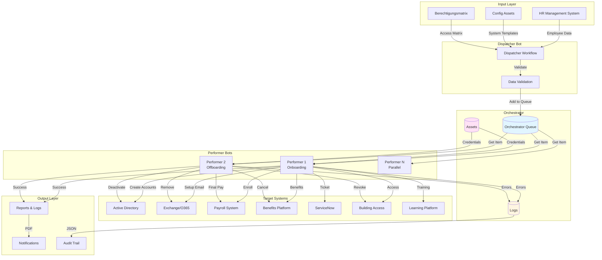
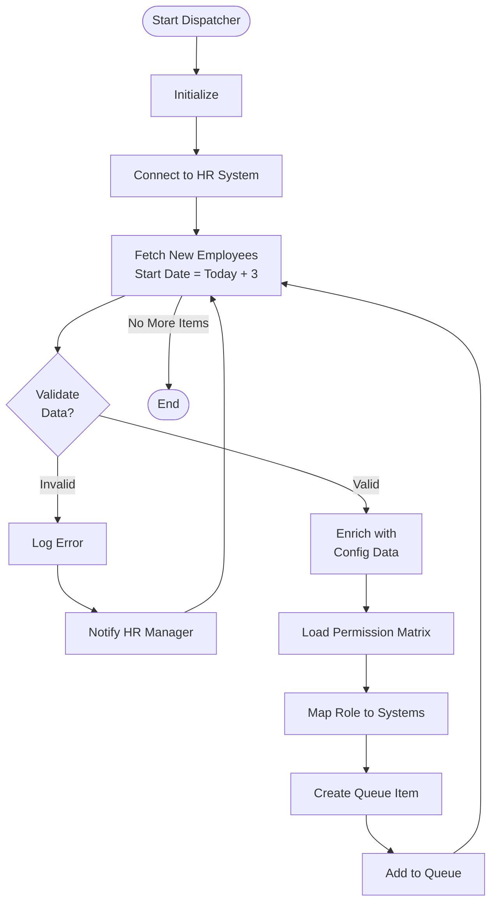
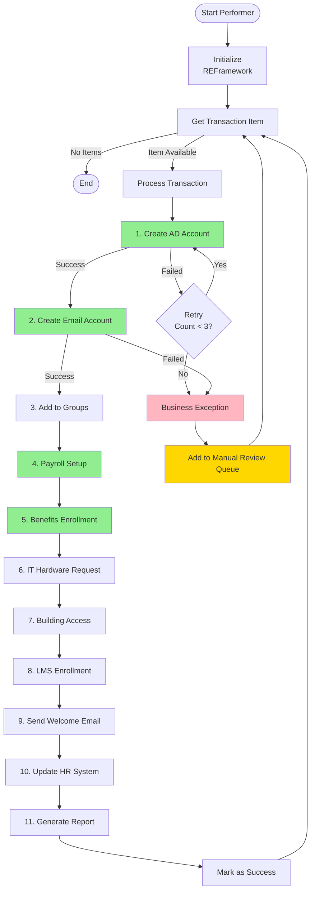
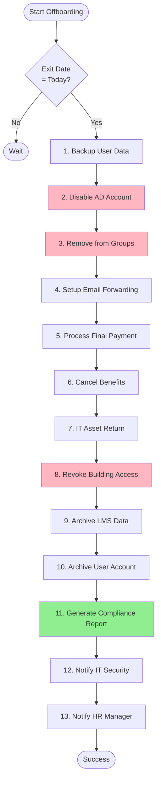
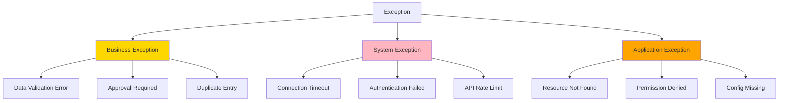

# UC-001: Employee Onboarding and Offboarding - Technische Dokumentation

**Erstellt:** 2025-12-02  
**Version:** 1.0  
**Autor:** AI Assistant (basierend auf UC-001)  
**Status:** Review  
**Tags:** `hr-automation`, `onboarding`, `offboarding`, `reframework`, `dispatcher-performer`  
**Related Use Case:** [UC-001 Onboarding](../usecases/uc-001%20Onboarding.md)

---

## Executive Summary

Diese technische Dokumentation beschreibt die Implementierung einer End-to-End HR-Automatisierungslösung für Employee Onboarding und Offboarding mit UIPath. Die Lösung automatisiert administrative Aufgaben über 8-12 verschiedene Systeme hinweg und reduziert die Onboarding-Zeit von 3 Tagen auf 4 Stunden bei gleichzeitiger Sicherstellung vollständiger Compliance und Audit-Trails.

**Kernmerkmale:**
- REFramework-basierte Architektur mit Dispatcher-Performer Pattern
- Multi-System-Integration (HR, AD, E-Mail, Payroll, Benefits, ITSM)
- Vollständige Fehlerbehandlung mit manuellem Review-Prozess
- GDPR-konforme Datenverwaltung mit Sensitive Data Masking
- 99.5% Verfügbarkeit mit Fallback-Mechanismen

**Zielgruppe:** HR-Abteilung, IT Operations, Security & Compliance

---

## Architektur-Übersicht



---

## Detaillierte Prozessbeschreibung

### Dispatcher-Workflow



### Performer-Workflow (Onboarding)



### Performer-Workflow (Offboarding)



---

## Technische Implementierung

### UIPath Komponenten

#### Workflows

```
OnboardingOffboarding.Main/
├── Dispatcher/
│   ├── Main.xaml
│   ├── FetchEmployeeData.xaml
│   ├── ValidateEmployee.xaml
│   ├── EnrichWithConfig.xaml
│   └── CreateQueueItem.xaml
├── Performer/
│   ├── Main.xaml (REFramework)
│   ├── InitAllApplications.xaml
│   ├── GetTransactionData.xaml
│   ├── Process.xaml
│   │   ├── Onboarding/
│   │   │   ├── CreateADAccount.xaml
│   │   │   ├── CreateEmailAccount.xaml
│   │   │   ├── SetupPayroll.xaml
│   │   │   ├── EnrollBenefits.xaml
│   │   │   ├── CreateITSMTicket.xaml
│   │   │   ├── SetupBuildingAccess.xaml
│   │   │   └── SendWelcomeEmail.xaml
│   │   └── Offboarding/
│   │       ├── BackupUserData.xaml
│   │       ├── DisableADAccount.xaml
│   │       ├── RemoveEmailGroups.xaml
│   │       ├── ProcessFinalPayment.xaml
│   │       ├── CancelBenefits.xaml
│   │       └── GenerateComplianceReport.xaml
│   ├── SetTransactionStatus.xaml
│   └── TakeScreenshot.xaml
├── Framework/
│   ├── InitAllSettings.xaml
│   ├── KillAllProcesses.xaml
│   └── CloseAllApplications.xaml
└── Tests/
    ├── TestADConnection.xaml
    ├── TestEmailConnection.xaml
    └── TestPayrollConnection.xaml
```

#### Activities (Custom/Reusable)

```
CustomActivities.HR/
├── ADAccountManager.cs
│   ├── CreateUser()
│   ├── DisableUser()
│   ├── AddToGroup()
│   └── RemoveFromGroup()
├── EmailManager.cs
│   ├── CreateMailbox()
│   ├── SetupForwarding()
│   └── AddToDistributionList()
├── PayrollConnector.cs
│   ├── CreateEmployee()
│   ├── UpdateEmployee()
│   └── ProcessFinalPayment()
└── ComplianceReporter.cs
    ├── GenerateAuditLog()
    ├── GenerateComplianceReport()
    └── MaskSensitiveData()
```

#### Orchestrator Assets

```
Assets/
├── Credentials/
│   ├── HRSystemCredential
│   ├── ADServiceAccount
│   ├── ExchangeAdminCredential
│   ├── PayrollAPIKey
│   └── ServiceNowAPIToken
├── Config/
│   ├── HRSystemURL
│   ├── ADDomainController
│   ├── EmailServer
│   ├── PayrollAPIEndpoint
│   └── ServiceNowInstance
└── Templates/
    ├── OnboardingTemplate.json
    ├── OffboardingTemplate.json
    └── PermissionMatrix.xlsx
```

---

## Best Practices (aus Recherche)

### 1. Configuration Management

**Aus Video-Transcript (JTCUsLKwzKA):**
> "Avoid Hard Coding: Refrain from embedding fixed values like file paths or URLs directly in workflows to prevent future rework. Use Configuration Files to enhance flexibility."

**Implementierung:**
```vb
' ❌ Schlecht: Hard-coded
AD_Server = "dc01.company.com"

' ✅ Gut: Config Asset
AD_Server = Config("ADDomainController").ToString
```

**Config-Struktur (Orchestrator Asset):**
```json
{
  "HRSystem": {
    "URL": "https://hr.company.com/api",
    "Timeout": 30,
    "RetryCount": 3
  },
  "ActiveDirectory": {
    "Server": "dc01.company.com",
    "BaseDN": "OU=Users,DC=company,DC=com"
  },
  "Email": {
    "Server": "exchange.company.com",
    "DefaultDomain": "@company.com"
  },
  "Notifications": {
    "HRManagerEmail": "hr-manager@company.com",
    "ITSecurityEmail": "security@company.com"
  }
}
```

### 2. REFramework Pattern

**Best Practice:**
- **Init State**: Connections zu allen Systemen aufbauen, Config laden
- **Get Transaction Data**: Queue Items abholen
- **Process Transaction**: Einzelnen Employee verarbeiten
- **End Process**: Cleanup und Final Reports

**Retry-Logic:**
```vb
' In Process.xaml
Try
    ' AD Account erstellen
    CreateADAccount(EmployeeData)
Catch ex As Exception
    If TransactionItem.RetryCount < 3 Then
        ' Business Exception → Retry
        Throw New BusinessRuleException("AD Account creation failed: " & ex.Message)
    Else
        ' Zu viele Retries → Manual Review
        LogMessage("Max retries reached for " & EmployeeData("EmployeeID").ToString, LogLevel.Error)
        AddToManualReviewQueue(TransactionItem)
    End If
End Try
```

### 3. Error Handling & Logging

**Aus Best-Practices.md:**
> "Exception Handling: REFramework mit Retry-Logic, manuelle Review-Queue bei persistenten Fehlern. Detailliertes Logging in Orchestrator mit Sensitive Data Masking."

**Logging-Strategie:**
```vb
' Sensitive Data Masking
Function MaskSensitiveData(data As String) As String
    ' Passwörter, SSN, etc. maskieren
    Return Regex.Replace(data, "(?<=password"":"")\w+", "***MASKED***")
End Function

' Structured Logging
LogMessage(
    "Onboarding started for employee: " & MaskSensitiveData(EmployeeData.ToString),
    LogLevel.Info,
    New Dictionary(Of String, Object) From {
        {"EmployeeID", EmployeeData("EmployeeID")},
        {"Department", EmployeeData("Department")},
        {"StartDate", EmployeeData("StartDate")}
    }
)
```

### 4. Dispatcher-Performer Pattern

**Warum?**
- **Skalierbarkeit**: Mehrere Performer parallel
- **Fehler-Isolation**: Ein Fehler betrifft nicht alle
- **Queue-Management**: Orchestrator verwaltet Workload

**Queue Item Struktur:**
```json
{
  "SpecificContent": {
    "EmployeeID": "EMP-12345",
    "FirstName": "John",
    "LastName": "Doe",
    "Department": "IT",
    "Position": "Software Developer",
    "StartDate": "2025-12-05",
    "ManagerEmail": "manager@company.com",
    "ProcessType": "Onboarding",
    "RequiredSystems": [
      "ActiveDirectory",
      "Email",
      "Payroll",
      "Benefits",
      "ITSM",
      "BuildingAccess",
      "LMS"
    ],
    "Permissions": {
      "ADGroups": ["Domain Users", "IT-Department", "VPN-Users"],
      "EmailGroups": ["all-employees@company.com", "it-dept@company.com"],
      "Applications": ["Jira", "Confluence", "Azure DevOps"]
    }
  },
  "Priority": "Normal",
  "DeferDate": null,
  "DueDate": "2025-12-05T08:00:00Z"
}
```

### 5. System Integration

#### a) Active Directory (API)

```vb
' Using DirectoryServices
Imports System.DirectoryServices
Imports System.DirectoryServices.AccountManagement

Public Function CreateADUser(userData As Dictionary(Of String, Object)) As Boolean
    Try
        Using context As New PrincipalContext(ContextType.Domain, Config("ADServer").ToString)
            Using user As New UserPrincipal(context)
                user.SamAccountName = userData("EmployeeID").ToString
                user.GivenName = userData("FirstName").ToString
                user.Surname = userData("LastName").ToString
                user.DisplayName = userData("FirstName").ToString & " " & userData("LastName").ToString
                user.EmailAddress = userData("Email").ToString
                user.Enabled = True
                user.UserPrincipalName = userData("EmployeeID").ToString & "@company.com"
                
                ' Initial Password
                Dim tempPassword As String = GenerateSecurePassword()
                user.SetPassword(tempPassword)
                user.ExpirePasswordNow()
                
                user.Save()
                
                ' Add to Groups
                For Each groupName As String In userData("ADGroups")
                    Using group As GroupPrincipal = GroupPrincipal.FindByIdentity(context, groupName)
                        If group IsNot Nothing Then
                            group.Members.Add(user)
                            group.Save()
                        End If
                    End Using
                Next
                
                LogMessage("AD User created: " & userData("EmployeeID").ToString, LogLevel.Info)
                Return True
            End Using
        End Using
    Catch ex As Exception
        LogMessage("AD User creation failed: " & ex.Message, LogLevel.Error)
        Return False
    End Try
End Function
```

#### b) Exchange/Office 365 (PowerShell)

```vb
' Using Invoke PowerShell Activity
Dim psScript As String = "
    Connect-ExchangeOnline -CertificateThumbprint {0} -AppId {1} -Organization {2}
    
    # Create Mailbox
    New-Mailbox -Name '{3}' -UserPrincipalName '{4}' -PrimarySmtpAddress '{5}' -DisplayName '{6}'
    
    # Add to Distribution Groups
    Add-DistributionGroupMember -Identity 'all-employees@company.com' -Member '{5}'
    Add-DistributionGroupMember -Identity '{7}' -Member '{5}'
    
    Disconnect-ExchangeOnline -Confirm:$false
"

psScript = String.Format(
    psScript,
    Config("ExchangeCertThumbprint").ToString,
    Config("ExchangeAppId").ToString,
    Config("ExchangeOrganization").ToString,
    employeeName,
    employeeUPN,
    employeeEmail,
    employeeDisplayName,
    departmentDL
)

Invoke Power Shell(psScript)
```

#### c) Payroll System (REST API)

```vb
' HTTP Request Activity
Dim apiUrl As String = Config("PayrollAPIEndpoint").ToString & "/employees"
Dim apiKey As String = GetAsset("PayrollAPIKey").ToString

Dim requestBody As New JObject(
    New JProperty("employeeId", employeeData("EmployeeID")),
    New JProperty("firstName", employeeData("FirstName")),
    New JProperty("lastName", employeeData("LastName")),
    New JProperty("department", employeeData("Department")),
    New JProperty("position", employeeData("Position")),
    New JProperty("startDate", employeeData("StartDate")),
    New JProperty("salary", employeeData("Salary")),
    New JProperty("paymentMethod", "Direct Deposit"),
    New JProperty("bankAccount", employeeData("BankAccount"))
)

Dim response As HttpResponseMessage = HttpClient.PostAsync(
    apiUrl,
    New StringContent(requestBody.ToString, Encoding.UTF8, "application/json"),
    New Dictionary(Of String, String) From {
        {"Authorization", "Bearer " & apiKey},
        {"Content-Type", "application/json"}
    }
).Result

If response.IsSuccessStatusCode Then
    LogMessage("Payroll record created successfully", LogLevel.Info)
Else
    Throw New ApplicationException("Payroll API failed: " & response.ReasonPhrase)
End If
```

#### d) ServiceNow (REST API)

```vb
' IT Hardware Request Ticket
Dim ticketBody As New JObject(
    New JProperty("short_description", "New Hire Hardware Request: " & employeeName),
    New JProperty("description", 
        "New hire starting on " & startDate.ToString("yyyy-MM-dd") & vbCrLf &
        "Required Hardware:" & vbCrLf &
        "- Laptop: " & hardwareProfile("Laptop") & vbCrLf &
        "- Monitor(s): " & hardwareProfile("Monitors") & vbCrLf &
        "- Phone: " & hardwareProfile("Phone") & vbCrLf &
        "- Accessories: " & hardwareProfile("Accessories")
    ),
    New JProperty("category", "Hardware"),
    New JProperty("subcategory", "New Hire"),
    New JProperty("urgency", "2"),
    New JProperty("priority", "2"),
    New JProperty("assigned_to", Config("ITHardwareGroup").ToString),
    New JProperty("requested_for", employeeEmail),
    New JProperty("due_date", startDate.AddDays(-1).ToString("yyyy-MM-dd"))
)

Dim snowResponse = PostToServiceNow("/api/now/table/sc_request", ticketBody)
Dim ticketNumber = snowResponse("result")("number").ToString
LogMessage("ServiceNow ticket created: " & ticketNumber, LogLevel.Info)
```

### 6. GDPR Compliance

**Aus Use Case:**
> "Sicherheit: Verschlüsselte Credential-Verwaltung, keine Passwörter in Logs, Compliance mit GDPR. GDPR: Archivierung statt Löschung von Mitarbeiterdaten."

**Implementierung:**

```vb
' Data Retention Policy (nach Offboarding)
Function ArchiveUserData(employeeId As String) As Boolean
    Try
        ' 1. Backup aller Daten
        Dim userData As Dictionary = FetchAllUserData(employeeId)
        
        ' 2. Verschlüsseln
        Dim encryptedData As String = EncryptData(userData.ToString, Config("EncryptionKey").ToString)
        
        ' 3. In Archive speichern (Blob Storage / Database)
        SaveToArchive(employeeId, encryptedData, DateTime.Now.AddYears(7)) ' 7 Jahre Aufbewahrung
        
        ' 4. Sensitive Data aus Produktiv-Systemen löschen
        RemoveSensitiveDataFromProduction(employeeId)
        
        LogMessage("User data archived for: " & employeeId, LogLevel.Info)
        Return True
    Catch ex As Exception
        LogMessage("Archive failed: " & ex.Message, LogLevel.Error)
        Return False
    End Try
End Function

' Sensitive Data Masking in Logs
Function LogUserAction(action As String, employeeData As Dictionary) As Nothing
    Dim maskedData As New Dictionary(Of String, Object)
    
    For Each kvp As KeyValuePair(Of String, Object) In employeeData
        If SensitiveFields.Contains(kvp.Key) Then
            maskedData(kvp.Key) = "***MASKED***"
        Else
            maskedData(kvp.Key) = kvp.Value
        End If
    Next
    
    LogMessage(action & ": " & JsonConvert.SerializeObject(maskedData), LogLevel.Info)
End Function
```

---

## Exception Handling

### Exception-Hierarchie



### Exception Handling Strategy

```vb
' In Process.xaml (REFramework)
Try
    ' Step 1: Create AD Account
    CreateADAccount(TransactionItem)
    
    ' Step 2: Create Email
    CreateEmailAccount(TransactionItem)
    
    ' ... weitere Schritte
    
Catch ex As BusinessRuleException
    ' Retry möglich
    LogMessage("Business Exception: " & ex.Message, LogLevel.Warning)
    If TransactionItem.RetryCount < MaxRetries Then
        Throw ex ' REFramework retried
    Else
        AddToManualReviewQueue(TransactionItem, ex.Message)
        SetTransactionStatus(TransactionItem, "Failed - Manual Review Required")
    End If
    
Catch ex As SystemException
    ' System-Fehler → Sofort abbrechen
    LogMessage("System Exception: " & ex.Message, LogLevel.Error)
    NotifyITSupport(ex)
    SetTransactionStatus(TransactionItem, "Failed - System Error")
    Throw ex ' Stop Processing
    
Catch ex As Exception
    ' Unerwartete Fehler
    LogMessage("Unexpected Exception: " & ex.Message, LogLevel.Fatal)
    TakeScreenshot()
    NotifyProcessOwner(ex)
    SetTransactionStatus(TransactionItem, "Failed - Unknown Error")
    Throw ex
End Try
```

### Manual Review Queue

```vb
' Add to Manual Review Queue
Function AddToManualReviewQueue(
    transactionItem As QueueItem,
    errorMessage As String
) As Boolean
    Try
        Dim reviewData As New Dictionary(Of String, Object) From {
            {"OriginalQueueItem", transactionItem.SpecificContent},
            {"ErrorMessage", errorMessage},
            {"FailedStep", CurrentStep},
            {"RetryCount", transactionItem.RetryCount},
            {"Timestamp", DateTime.Now},
            {"AssignedTo", "HR-Manager"}
        }
        
        ' Add to separate "ManualReview" Queue
        AddQueueItem(
            QueueName:="HR_ManualReview",
            ItemInformation:=reviewData,
            Priority:=OrchestratorQueueItemPriority.High,
            DueDate:=DateTime.Now.AddHours(4)
        )
        
        ' Send Email Notification
        SendEmailNotification(
            To:=Config("HRManagerEmail").ToString,
            Subject:="Manual Review Required: " & transactionItem.SpecificContent("EmployeeID").ToString,
            Body:="Onboarding process requires manual review." & vbCrLf &
                  "Employee: " & transactionItem.SpecificContent("FirstName").ToString & " " &
                  transactionItem.SpecificContent("LastName").ToString & vbCrLf &
                  "Error: " & errorMessage & vbCrLf &
                  "Please review in Orchestrator Queue: HR_ManualReview"
        )
        
        Return True
    Catch ex As Exception
        LogMessage("Failed to add to manual review: " & ex.Message, LogLevel.Error)
        Return False
    End Try
End Function
```

---

## Testing & Validierung

### Unit Tests

```vb
' TestADConnection.xaml
Test Case: AD Connection
    Given: AD Service Account credentials
    When: Connect to Domain Controller
    Then: Connection successful AND Can query users
    
Expected Result: ✅ Connection established
Actual Result: ✅ Connected to dc01.company.com
```

### Integration Tests

```
Test Suite: End-to-End Onboarding
├── Test 1: Happy Path (alle Systeme erreichbar)
│   Input: Valid Employee Data
│   Expected: ✅ All accounts created, Welcome email sent
│   
├── Test 2: Missing Email Domain
│   Input: Employee without email
│   Expected: ⚠️ Business Exception, Manual Review
│   
├── Test 3: Duplicate AD Account
│   Input: Employee ID already exists
│   Expected: ⚠️ Business Exception, Manual Review
│   
├── Test 4: Payroll API Timeout
│   Input: Valid data, Payroll API down
│   Expected: 🔄 Retry 3x, then Manual Review
│   
└── Test 5: Network Failure
    Input: Valid data, Network down
    Expected: ❌ System Exception, Stop process
```

### UAT Checklist

- [ ] **Onboarding Complete**: Neuer Mitarbeiter kann sich am ersten Tag anmelden
- [ ] **All Systems Accessible**: Zugriff auf alle erforderlichen Systeme
- [ ] **Email Received**: Willkommens-E-Mail mit Credentials erhalten
- [ ] **Hardware Ready**: IT Hardware Request in ServiceNow erstellt
- [ ] **Building Access**: Zugangskarte funktioniert
- [ ] **Audit Trail**: Vollständiges Log in Orchestrator
- [ ] **Offboarding Complete**: Alle Zugänge deaktiviert nach Kündigungsdatum
- [ ] **Compliance Report**: PDF-Report mit allen Deaktivierungen
- [ ] **No Data Leaks**: Keine sensiblen Daten in Logs

---

## Deployment

### Pre-Deployment Checklist

```
Environment Setup:
├── Orchestrator
│   ├── [ ] Queue "HR_Onboarding" erstellt
│   ├── [ ] Queue "HR_ManualReview" erstellt
│   ├── [ ] Assets hochgeladen (Credentials, Config)
│   ├── [ ] Robots registriert (min. 2 Performer)
│   └── [ ] Storage Buckets konfiguriert
│   
├── Service Accounts
│   ├── [ ] AD Service Account mit Permissions
│   ├── [ ] Exchange Admin Account
│   ├── [ ] Payroll API Key
│   ├── [ ] ServiceNow API Token
│   └── [ ] Building Access System Token
│   
├── Network
│   ├── [ ] VPN für On-Premise Systeme
│   ├── [ ] Firewall-Regeln für APIs
│   └── [ ] Rate Limits abgestimmt
│   
└── Monitoring
    ├── [ ] Orchestrator Alerts konfiguriert
    ├── [ ] Email-Notifications eingerichtet
    └── [ ] Log Archiving aktiviert
```

### Deployment Steps

```bash
# 1. Publish Dispatcher to Orchestrator
uipath package pack --output Dispatcher.nupkg
uipath package deploy --packagePath Dispatcher.nupkg --folder "Production/HR"

# 2. Publish Performer to Orchestrator
uipath package pack --output Performer.nupkg
uipath package deploy --packagePath Performer.nupkg --folder "Production/HR"

# 3. Create Processes
uipath orchestrator process create --name "HR_Onboarding_Dispatcher" --packageId Dispatcher.1.0.0
uipath orchestrator process create --name "HR_Onboarding_Performer" --packageId Performer.1.0.0

# 4. Create Triggers
# Dispatcher: Daily at 06:00 AM
uipath orchestrator trigger create \
  --name "HR_Onboarding_Daily" \
  --processName "HR_Onboarding_Dispatcher" \
  --cronExpression "0 6 * * *"

# Performer: Start when Queue has items
uipath orchestrator trigger create \
  --name "HR_Onboarding_QueueTrigger" \
  --processName "HR_Onboarding_Performer" \
  --queueName "HR_Onboarding" \
  --numberOfRobots 3
```

### Rollback Plan

```
Bei Problemen:
1. Stop all running jobs in Orchestrator
2. Disable Triggers
3. Revert to previous package version
4. Clear Queue (move items to backup)
5. Investigate logs
6. Fix issues
7. Re-deploy
8. Re-enable Triggers
```

---

## Monitoring & Maintenance

### KPIs & Dashboards

```
Orchestrator Dashboard:
├── Onboarding Metrics
│   ├── Durchschnittliche Verarbeitungszeit: < 4h
│   ├── Erfolgsrate: > 95%
│   ├── Manual Review Rate: < 5%
│   └── Fehlerrate: < 1%
│   
├── Offboarding Metrics
│   ├── Compliance Rate: 100%
│   ├── Durchschnittliche Zeit: < 2h
│   └── Deaktivierungsverzögerung: 0 (same day)
│   
└── System Health
    ├── Bot Availability: > 99.5%
    ├── API Response Times: < 2s
    └── Queue Wait Time: < 30 min
```

### Alerts

```vb
' Alert Configuration (Orchestrator)
Alert Triggers:
├── Business Exception Rate > 10% → Email HR Manager
├── System Exception → Email IT Support (immediately)
├── Queue Wait Time > 1 hour → Email Process Owner
├── Manual Review Items > 5 → Email HR Manager
├── Offboarding not completed on time → Email IT Security
└── Bot Offline > 30 min → Email RPA Team
```

### Log Retention

```
Log Strategy:
├── Orchestrator Logs: 90 days (rotating)
├── Audit Logs: 7 years (compliance)
├── Screenshot on Error: 30 days
└── Reports: 3 years (PDF in Blob Storage)
```

### Maintenance Schedule

```
Weekly:
- [ ] Review Manual Review Queue
- [ ] Check KPIs vs Targets
- [ ] Review failed transactions

Monthly:
- [ ] Update Permission Matrix
- [ ] Review and update Config Assets
- [ ] Performance tuning
- [ ] Update documentation

Quarterly:
- [ ] Full UAT
- [ ] Security Review
- [ ] Capacity Planning
- [ ] Stakeholder Review
```

---

## Referenzen

### UIPath Docs
- [REFramework Documentation](https://docs.uipath.com/studio/docs/about-the-reframework-template)
- [Queue Management](https://docs.uipath.com/orchestrator/docs/managing-queues)
- [Active Directory Activities](https://docs.uipath.com/activities/docs/active-directory-scope)
- [Email Activities](https://docs.uipath.com/activities/docs/mail-activities)
- [HTTP Request Activity](https://docs.uipath.com/activities/docs/http-request)
- [Orchestrator Assets](https://docs.uipath.com/orchestrator/docs/managing-assets)

### Video Tutorials
- [Best Practices: Avoid Hard Coding](../videos/JTCUsLKwzKA-wisdom-openai.md) - Configuration File Strategy
- [UIPath Full Course](../videos/t8GD483JBSA-transcript-whisper.txt) - HR Automation Use Cases
- [Solution Architecture](../videos/lkrS9ZJ_LiE-transcript-whisper.txt) - Build Stage & Documentation

### Internal Knowledge Base
- [UIPath Best Practices](best-practices.md) - General Guidelines
- [Use Case Template](../usecases/usecase-template.md) - Business Requirements

### Community Resources
- Reddit r/UiPath: HR Automation Discussions (to be searched)
- UIPath Forum: Onboarding/Offboarding Threads

### Compliance
- GDPR Article 5: Data Minimization
- GDPR Article 17: Right to Erasure (Archiving Strategy)
- ISO 27001: Information Security Management

---

## Anhang

### A. Berechtigungsmatrix Beispiel

| Position | AD Groups | Email Groups | Applications | Building Access |
|----------|-----------|--------------|--------------|----------------|
| Software Developer | Domain Users, IT-Dept, VPN-Users, Developers | all-employees, it-dept, dev-team | Jira, Confluence, Azure DevOps, GitHub | Office, Server Room |
| HR Manager | Domain Users, HR-Dept, VPN-Users, Managers | all-employees, hr-dept, management | HR System, Payroll, Benefits Admin | Office |
| Sales Rep | Domain Users, Sales-Dept, VPN-Users | all-employees, sales-dept, customer-list | CRM, Sales Tools, Email | Office |

### B. Error Codes

| Code | Beschreibung | Action |
|------|--------------|--------|
| ERR-AD-001 | AD Account already exists | Manual Review |
| ERR-AD-002 | AD Connection timeout | System Exception, Retry |
| ERR-EMAIL-001 | Email address already in use | Manual Review |
| ERR-PAY-001 | Payroll API rate limit | Wait & Retry |
| ERR-PAY-002 | Invalid employee data | Business Exception |
| ERR-ITSM-001 | ServiceNow authentication failed | System Exception |
| ERR-VAL-001 | Missing mandatory fields | Business Exception |
| ERR-VAL-002 | Invalid date format | Business Exception |

### C. Performance Benchmarks

| Process Step | Target | Actual (Avg) |
|--------------|--------|--------------|
| Dispatcher: Fetch Employee Data | < 5 min | 3.2 min |
| Performer: Create AD Account | < 30 sec | 18 sec |
| Performer: Create Email | < 45 sec | 32 sec |
| Performer: Setup Payroll | < 1 min | 48 sec |
| Performer: Complete Onboarding | < 4 hours | 3.5 hours |
| Offboarding: Complete Process | < 2 hours | 1.8 hours |

---

**Version History:**
- v1.0 (2025-12-02): Initial technical documentation
- Based on Use Case UC-001, UIPath Docs, Video Transcripts, Best Practices KB

**Next Steps:**
1. Review with HR Manager & IT Security
2. UAT in Test Environment
3. Production Deployment
4. Monitoring & Optimization

---

**Tags:** `hr-automation`, `onboarding`, `offboarding`, `reframework`, `dispatcher-performer`, `active-directory`, `compliance`, `gdpr`
