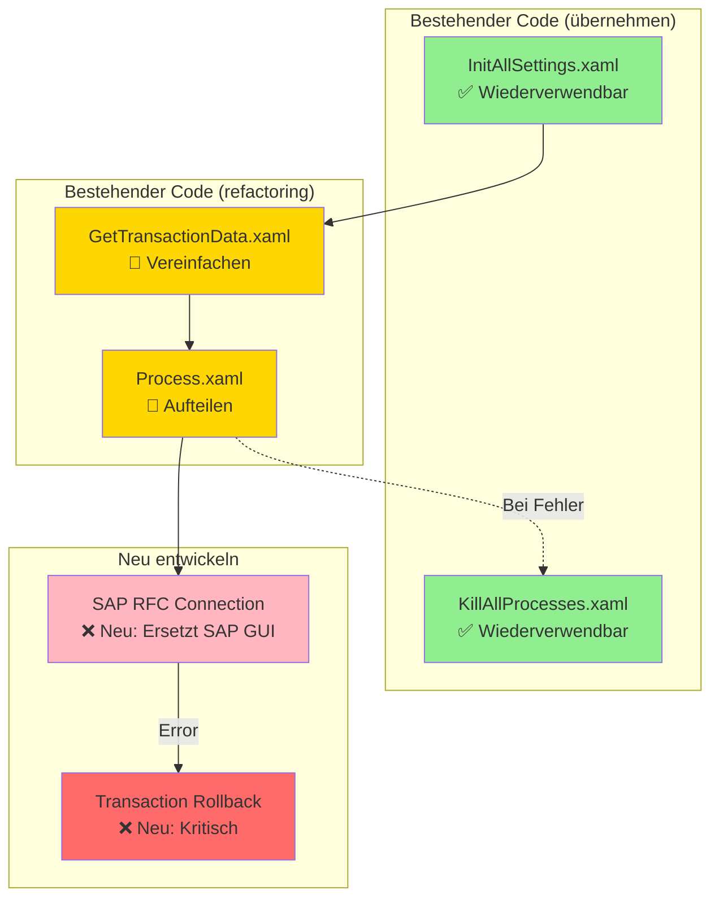

# Beispiel: Code-Analyse in analysis.md

Dieses Dokument zeigt, wie die Section "🔍 Analyse bestehender UiPath-Lösung" aussehen sollte, wenn Code in `assets/uipath-solution/` vorhanden ist.

---

## 🔍 Analyse bestehender UiPath-Lösung

> **Geprüft:** `assets/uipath-solution/` (Main.xaml, Config/, Framework/)

### Code-Übersicht

**Haupt-Workflows:**
- `Main.xaml` - Orchestriert den Gesamtprozess mit REFramework-Pattern
- `Framework/InitAllSettings.xaml` - Lädt Konfiguration aus Config/Config.xlsx
- `Framework/GetTransactionData.xaml` - Holt Daten aus Orchestrator Queue
- `Framework/Process.xaml` - Verarbeitet einzelne Transaktion

**Dependencies:**
- UiPath.System.Activities 23.10.3
- UiPath.Excel.Activities 2.22.4
- UiPath.Mail.Activities 1.21.0

### Qualitäts-Assessment

#### ✅ Gut umgesetzt

1. **Exception Handling**
   - TryCatch-Blöcke in allen kritischen Workflows
   - Business Exceptions korrekt von System Exceptions getrennt
   - Exception-Details werden geloggt

2. **Config-Management**
   - Zentrale Config in `Config/Config.xlsx`
   - Environments (Dev/Test/Prod) unterstützt
   - Credentials aus Orchestrator Assets

3. **Logging**
   - Log-Levels konsistent verwendet
   - Log Messages strukturiert mit Timestamps

#### ⚠️ Verbesserungsbedarf

1. **Hardcoded Werte**
   - 3 Email-Adressen direkt im XAML
   - Timeout-Werte nicht konfigurierbar
   - **Empfehlung:** In Config.xlsx auslagern

2. **Error Recovery**
   - Bei SAP-Verbindungsabbruch kein Retry-Mechanismus
   - **Empfehlung:** Exponential Backoff implementieren

3. **Modularity**
   - `Process.xaml` ist 500+ Activities groß
   - **Empfehlung:** In kleinere Sub-Workflows aufteilen
     - `Process_ValidateInput.xaml`
     - `Process_CreateInvoice.xaml`
     - `Process_SendEmail.xaml`

#### ❌ Kritische Probleme

1. **Fehlende Transaction Rollback**
   - Bei Fehler in SAP wird keine Kompensierung durchgeführt
   - Kann zu inkonsistenten Daten führen
   - **Risiko:** HOCH
   - **Action:** Vor Go-Live implementieren!

2. **Secrets in Config**
   - API-Key für Drittanbieter in Config.xlsx gespeichert
   - **Risiko:** KRITISCH (Security)
   - **Action:** Sofort in Orchestrator Credential Store verschieben!

### Wiederverwendbare Komponenten

**Übernehmen (keine Änderungen):**
- ✅ `Framework/InitAllSettings.xaml` - Robust implementiert
- ✅ `Framework/KillAllProcesses.xaml` - Wiederverwendbar
- ✅ `Framework/TakeScreenshot.xaml` - Gut dokumentiert

**Refactoring vor Übernahme:**
- 🔄 `Framework/GetTransactionData.xaml` - Vereinfachen (zu komplex)
- 🔄 `Framework/Process.xaml` - Aufteilen in Sub-Workflows

**Neu entwickeln:**
- ❌ `SAP_Login.xaml` - Veraltete SAP GUI Automation (auf SAP RFC umstellen)

### Empfohlene Refactorings

#### Kurzfristig (vor Go-Live)

| Prio | Refactoring | Aufwand | Risiko |
|------|-------------|---------|--------|
| 🔴 | Secrets aus Config entfernen | 2h | Security |
| 🔴 | Transaction Rollback implementieren | 1 Tag | Data Integrity |
| 🟡 | Hardcoded Werte in Config | 4h | Wartbarkeit |
| 🟡 | SAP Error Recovery mit Retry | 1 Tag | Stabilität |

#### Mittelfristig (nach MVP)

| Refactoring | Aufwand | Nutzen |
|-------------|---------|--------|
| Process.xaml aufteilen | 2 Tage | Testbarkeit, Wiederverwendbarkeit |
| SAP GUI → SAP RFC Migration | 1 Woche | Performance, Stabilität |
| Unit Tests für Business Logic | 3 Tage | Qualitätssicherung |

### Code-Quality-Metriken

| Metrik | Wert | Benchmark | Status |
|--------|------|-----------|--------|
| Workflows | 12 | < 20 | ✅ OK |
| Durchschn. Workflow-Größe | 180 Activities | < 150 | ⚠️ Zu groß |
| TryCatch-Coverage | 85% | > 90% | 🟡 Fast gut |
| Config-Items hardcoded | 7 | 0 | ❌ Schlecht |
| Dependencies veraltet | 0 | 0 | ✅ Aktuell |

---

## 🏗️ Vorläufige Architektur (mit Bestandscode-Integration)

### Integration bestehender Komponenten

1. **Phase 1 - Quick Wins (1 Woche)**
   - Config bereinigen (Secrets entfernen)
   - Rollback-Mechanismus hinzufügen
   - Wiederverwendbare Workflows übernehmen

2. **Phase 2 - Refactoring (2 Wochen)**
   - Process.xaml aufteilen
   - SAP GUI → SAP RFC Migration
   - Unit Tests schreiben

3. **Phase 3 - Optimierung (1 Woche)**
   - Performance-Tuning
   - Code-Review
   - Dokumentation vervollständigen

---

## 💡 Fazit zur Bestandscode-Integration

**Positiv:**
- ✅ Gute Grundlage vorhanden (REFramework-Pattern)
- ✅ 60% des Codes wiederverwendbar
- ✅ Config-Management etabliert

**Kritisch:**
- ❌ 2 kritische Security/Data-Integrity-Probleme vor Go-Live
- ⚠️ Refactoring für bessere Wartbarkeit empfohlen

**Zeitersparnis:**
- Geschätzt 2-3 Wochen durch Wiederverwendung
- Aber: 1 Woche Refactoring notwendig
- **Netto-Ersparnis:** ~1-2 Wochen

**Empfehlung:**
Bestehenden Code als Basis nutzen, aber kritische Probleme sofort beheben und schrittweise refactoren.
