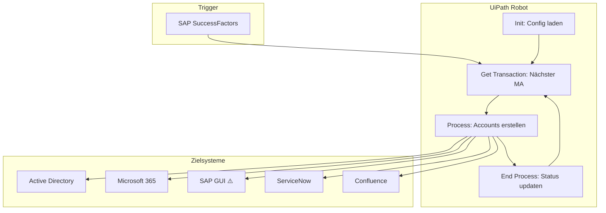

# UC-001: Employee Onboarding - Technische Analyse

**Related Use Case:** [README.md](./README.md)  
**Erstellt:** 2025-12-03  
**Status:** Analyse (Rückfragen offen)

---

## 🔴 Offene Rückfragen

> **Diese Fragen müssen vor der Implementierung geklärt werden!**

### Kritisch (Blockierend)

| # | Frage | Ansprechpartner | Status |
|---|-------|-----------------|--------|
| Q1 | Welche SAP-Version genau? ECC 6.0? S/4HANA? | Peter (IT) | ⏳ Offen |
| Q2 | Wie werden Passwörter initial gesetzt? Gibt es Vorgaben für Komplexität? | IT Security | ⏳ Offen |
| Q3 | Wer hat Admin-Rechte für Active Directory? Bekommen wir einen Service Account? | Peter (IT) | ⏳ Offen |
| Q4 | Welche M365-Lizenzen gibt es genau? (E1/E3/E5? F3 für Frontline?) | IT / Einkauf | ⏳ Offen |
| Q5 | Gibt es eine API für SuccessFactors oder müssen wir auch dort klicken? | HR-IT | ⏳ Offen |

### Wichtig (Sollte vor Go-Live geklärt sein)

| # | Frage | Ansprechpartner | Status |
|---|-------|-----------------|--------|
| Q6 | Was genau sind die "Sonderwünsche" der Abteilungen? (IT braucht mehr Rechte - welche?) | Hr. Müller (HR) | ⏳ Offen |
| Q7 | Gibt es eine Berechtigungsmatrix? Wer bekommt Zugang zu welchen Systemen? | HR + IT | ⏳ Offen |
| Q8 | Wie sieht die E-Mail-Vorlage für die Willkommensmail aus? | HR / Marketing | ⏳ Offen |
| Q9 | Soll der Manager die Zugangsdaten sehen oder nur der neue Mitarbeiter? | HR + Datenschutz | ⏳ Offen |
| Q10 | Gibt es ein CRM? Welches? Wer braucht Zugang? (Sales wurde erwähnt) | Sales + IT | ⏳ Offen |

### Nice-to-have (Kann später geklärt werden)

| # | Frage | Ansprechpartner | Status |
|---|-------|-----------------|--------|
| Q11 | Soll Offboarding auch automatisiert werden? | Hr. Müller (HR) | ⏳ Offen |
| Q12 | Gibt es Slack/Teams? Soll da eine Begrüßung rein? | IT / HR | ⏳ Offen |
| Q13 | Sollen Trainings automatisch zugewiesen werden (LMS)? | HR / L&D | ⏳ Offen |

---

## 📋 Zusammenfassung des Use Cases

### Verstandener Scope

Basierend auf dem README.md verstehe ich Folgendes:

**Trigger:** Neuer Mitarbeiter in SAP SuccessFactors (nach Vertragsunterschrift)

**Hauptschritte:**
1. Mitarbeiterdaten aus SuccessFactors auslesen
2. Windows-Account in Active Directory erstellen
3. Microsoft 365 E-Mail + Lizenz zuweisen
4. SAP-Zeiterfassung einrichten (UI Automation nötig!)
5. Hardware über ServiceNow bestellen
6. Confluence-Zugang einrichten
7. E-Mails versenden (an neuen MA + Manager)

**Ausnahmen:**
- Praktikanten/Werkstudenten: Keine Hardware
- Manager: Andere Lizenzen (welche genau? → Q4)
- IT-Abteilung: Mehr Rechte (welche genau? → Q6)

### Unklare Punkte aus dem README

| Thema | Im README | Was fehlt |
|-------|-----------|-----------|
| SAP-Version | "irgendeine alte Version" | Genaue Version für UI-Automation |
| Lizenzen | "verschiedene je nach Position" | Konkrete Zuordnung Position → Lizenz |
| Reihenfolge | "keiner weiß genau" | Offizielle Prozessdokumentation |
| Berechtigungen | Nur erwähnt | Komplette Matrix |
| Erfolgskriterien | "deutlich schneller" | Messbare KPIs |

---

## 🏗️ Vorläufige Architektur

### Empfohlenes Pattern: REFramework

**Begründung:**
- Queue-basierte Verarbeitung (jeder Mitarbeiter = 1 Transaction)
- Eingebautes Exception Handling
- Retry-Logic für instabile Systeme (SAP!)
- Audit-Trail über Orchestrator



### Systemanbindung (vorläufig)

| System | Schnittstelle | Risiko | Anmerkung |
|--------|---------------|--------|-----------|
| SAP SuccessFactors | API (OData?) | 🟡 Mittel | Muss verifiziert werden (Q5) |
| Active Directory | PowerShell/LDAP | 🟢 Niedrig | Standard, braucht Service Account (Q3) |
| Microsoft 365 | Graph API | 🟢 Niedrig | App Registration nötig |
| SAP GUI | UI Automation | 🔴 Hoch | Kein API, fehleranfällig |
| ServiceNow | REST API | 🟢 Niedrig | Standard |
| Confluence | REST API | 🟢 Niedrig | Standard |

---

## ⚠️ Identifizierte Risiken

### Technische Risiken

| Risiko | Wahrscheinlichkeit | Impact | Mitigation |
|--------|-------------------|--------|------------|
| SAP GUI Automation instabil | Hoch | Hoch | Screenshot-Validierung, manuelle Queue für Fehler |
| AD-Sync Verzögerung (zu Azure AD) | Mittel | Mittel | Warten + Retry nach M365-Schritten |
| Rate Limiting Microsoft Graph | Niedrig | Mittel | Throttling implementieren |
| VPN-Verbindung bricht ab | Mittel | Hoch | Robot auf VM im Firmennetz |

### Organisatorische Risiken

| Risiko | Beschreibung | Mitigation |
|--------|--------------|------------|
| Fehlende Ansprechpartner | "Peter aus der IT" - wer genau? | Klare Stakeholder-Liste erstellen |
| Unklare Prozesse | "Jeder macht es anders" | Workshop zur Prozess-Standardisierung |
| Zeitdruck vom Vorstand | Erwartungsmanagement | Scope klar definieren, MVP first |
| GDPR nicht geklärt | "irgendwas mit GDPR" | Datenschutzbeauftragten einbinden |

---

## 🔧 Vorläufige technische Details

### Empfohlene UIPath Activities (vorbehaltlich Klärung)

| Schritt | Activity / Package | Voraussetzung |
|---------|-------------------|---------------|
| SuccessFactors lesen | HTTP Request (OData) oder UIPath SAP Activities | Q5 klären |
| AD Account erstellen | `UiPath.ActiveDirectory.Activities` | Service Account (Q3) |
| M365 Lizenz | Microsoft Graph API via HTTP | App Registration |
| SAP GUI | `UiPath.SAP.BAPI.Activities` oder Screen Scraping | SAP-Version (Q1) |
| ServiceNow Ticket | REST API via HTTP Request | API-Zugang |
| Confluence | REST API via HTTP Request | API Token |
| E-Mail senden | `Send Outlook Mail Message` oder SMTP | Mail-Server Config |

### Credential Management

```
Orchestrator Assets (geplant):
├── AD_ServiceAccount (Credential)
├── M365_AppRegistration (Credential: ClientID + Secret)
├── SAP_RobotUser (Credential)
├── ServiceNow_APIKey (Credential)
├── Confluence_APIToken (Credential)
└── Config_OnboardingSettings (Asset: JSON)
```

### Exception Handling (vorläufig)

| Exception-Typ | Beispiel | Aktion |
|---------------|----------|--------|
| **Business Exception** | AD-Account existiert bereits | In Exception-Queue, keine Wiederholung |
| **Business Exception** | Pflichtfeld fehlt in SuccessFactors | In Exception-Queue mit Details |
| **System Exception** | SAP GUI nicht erreichbar | 3x Retry, dann Alert + Queue |
| **System Exception** | Graph API Timeout | 3x Retry mit Backoff |

---

## 📅 Empfohlenes Vorgehen

### Phase 1: Discovery (1-2 Wochen)

- [ ] Alle kritischen Fragen klären (Q1-Q5)
- [ ] Workshop mit HR zur Prozess-Standardisierung
- [ ] Technische Machbarkeit SAP GUI prüfen
- [ ] Service Accounts beantragen
- [ ] App Registration für M365 erstellen

### Phase 2: MVP (2-3 Wochen)

- [ ] Nur AD + M365 + E-Mail (die "sicheren" Systeme)
- [ ] SAP GUI zunächst ausklammern
- [ ] Manuelle Queue für Ausnahmen

### Phase 3: Erweiterung (2-3 Wochen)

- [ ] SAP GUI Integration
- [ ] ServiceNow Integration
- [ ] Confluence Integration
- [ ] Alle Business Rules implementieren

### Phase 4: Stabilisierung (1-2 Wochen)

- [ ] Monitoring & Alerting
- [ ] Dokumentation
- [ ] Übergabe an Operations

---

## 📊 Vorläufige Metriken

Basierend auf den Aussagen im README schlage ich folgende KPIs vor:

| KPI | Aktuell (geschätzt) | Ziel | Messmethode |
|-----|---------------------|------|-------------|
| Durchlaufzeit Onboarding | 2-3 Tage | < 4 Stunden | Orchestrator Logs |
| Fehlerrate Tag 1 | 15% | < 5% (MVP), < 1% (final) | HR-Feedback |
| HR-Zeitaufwand pro Onboarding | ~4 Stunden | < 30 min (nur Ausnahmen) | Zeiterfassung |
| Automatisierungsgrad | 0% | 80% (Standardfälle) | Orchestrator Queue Stats |

> ⚠️ Diese Zahlen müssen mit dem Fachbereich validiert werden!

---

## 🔗 Referenzen

### UIPath Dokumentation
- [REFramework Documentation](https://docs.uipath.com/studio/docs/robotic-enterprise-framework)
- [Active Directory Activities](https://docs.uipath.com/activities/docs/active-directory)
- [SAP GUI Automation](https://docs.uipath.com/activities/docs/sap)

### Best Practices
- Employee Onboarding ist ein häufiger RPA Use Case
- REFramework ist der Standard für transaktionale Prozesse
- UI Automation für Legacy-Systeme sollte minimiert werden

---

**Status:** Warte auf Beantwortung der kritischen Fragen (Q1-Q5)

**Nächster Schritt:** Meeting mit Peter (IT) und Hr. Müller (HR) zur Klärung der offenen Punkte
