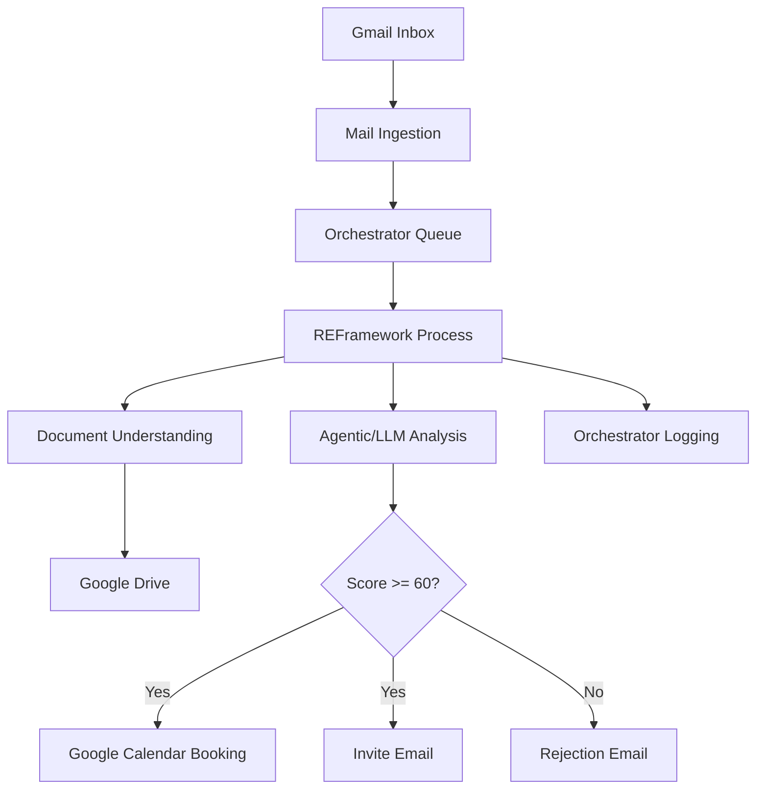

# UC-002: Bewerbungsanalyse & Matching – Technische Analyse

**Erstellt:** 2025-12-11  
**Version:** 0.1  
**Autor:** Copilot  
**Status:** Draft  
**Tags:** `HR`, `Document Understanding`, `Agentic`, `Google Workspace`, `UiPath`

---

## 🔴 Offene Rückfragen
> Diese Fragen müssen vor der Implementierung geklärt werden!

### Kritisch (Blockierend)
| # | Frage | Ansprechpartner | Status |
|---|-------|-----------------|--------|
| Q1 | Verfügbarkeit und Umfang der Google Workspace APIs (Mail, Drive, Calendar): sind Service Accounts/Domain-wide Delegation erlaubt? | IT / Google Admin | ⏳ Offen |
| Q2 | Auswahl der LLM/Analyse-Engine (OpenAI, Google Vertex AI, UiPath Autopilot/Agentic) inkl. Datenschutz- und Kostenfreigabe | IT Security / HR | ⏳ Offen |
| Q3 | Ziel-Ordnerschema in Google Drive (Namenskonventionen, Rechte, Aufbewahrungsfristen) | HR / IT | ⏳ Offen |
| Q4 | Textbausteine für Einladung/Absage (Mehrsprachigkeit? Freigabe durch HR) | HR | ⏳ Offen |

### Wichtig (Vor Go-Live klären)
| # | Frage | Ansprechpartner | Status |
|---|-------|-----------------|--------|
| Q5 | Teilnehmerliste und Kalender-Ressourcen (Interviewräume, Video-Links) | HR | ⏳ Offen |
| Q6 | Umgang mit fehlenden/unklaren Dokumenten (Fallback-Workflows) | HR | ⏳ Offen |
| Q7 | OCR-Strategie für schlechte PDFs (DU OCR vs. Google OCR) | Tech Lead | ⏳ Offen |
| Q8 | Logging-/Reporting-Konzept (Orchestrator + HR Dashboard) | HR / Tech Lead | ⏳ Offen |

### Nice-to-have
| # | Frage | Ansprechpartner | Status |
|---|-------|-----------------|--------|
| Q9 | ATS-Integration Roadmap | HR | ⏳ Offen |
| Q10 | Mehrsprachige Templates, Tonalität, Corporate Wording | HR | ⏳ Offen |

---

## 📋 Zusammenfassung des Use Cases
Ein Robot verarbeitet eingehende Bewerbungen aus der HR-Mailbox, extrahiert und speichert Dokumente strukturiert in Google Drive, analysiert CV/Motivationsschreiben sowie Stellenausschreibungen und berechnet einen Match Score (0–100). Bei Score ≥ 60 werden Einladung und Termin automatisch versendet; sonst folgt eine höfliche Absage. LLM-basierte Analyse (Agentic) ist vorgesehen; Stabilität, OCR-Qualität, DSGVO und API-Zugänge sind zentrale Randbedingungen.

Unklare Punkte: konkrete LLM-Auswahl, Drive-Struktur, E-Mail-Texte, Interviewteilnehmer, Rechte-/Accounts für Google APIs.

---

## 🏗️ Vorläufige Architektur

- Pattern: REFramework für robuste Verarbeitung, Queue-basierte Transaktionen pro Bewerbung.
- Ingestion: Gmail API Polling/Watch → Queue Items (Bewerbung).
- Storage: Google Drive API → Ordnerschema pro Kandidat/Stelle.
- Analysis: UiPath Document Understanding (DU) für OCR/Parsing; Agentic/LLM für semantisches Matching.
- Decision: Business Rule (Score Threshold 60) → Einladung/Absage.
- Calendar: Google Calendar API → Terminbuchung.
- Observability: Orchestrator Logs + Reporting Export.

---

## ⚠️ Identifizierte Risiken
- Datenschutz/DSGVO bei LLM-Nutzung (PII in Bewerbungen).  
- API-Zugangsrechte (Gmail/Drive/Calendar) und Service Accounts.  
- OCR-Qualität bei gescannten PDFs; unterschiedliche Dokumentformate.  
- Fehlende/inkonsistente Stellenausschreibungen (PDF-Struktur).  
- Bias/Transparenz der Matching-Logik; Erklärbarkeit erforderlich.  
- Skalierung bei Peaks (Batch-Incoming Bewerbungen).  

---

## 🔧 Vorläufige technische Details
- UiPath Packages: Mail (Gmail), GSuite, DU, System, Orchestrator, WebAPI.  
- Credentials: Orchestrator Assets (API Keys/Tokens), Secret Scope per Env.  
- Drive Schema: `/HR/Bewerbungen/<Jahr>/<Stelle>/<Kandidat-ID>/` mit Subfoldern (CV, Motivationsschreiben, Sonstiges).  
- DU Pipeline: Classification → OCR → Extraction (Key fields).  
- Matching: Features aus CV/Stelle extrahieren; Gewichtung + Threshold 60.  
- Error Handling: System/Business Exceptions in REFramework; Retry/Dead-letter Queue.  
- Logging: Orchestrator, zusätzlich CSV/JSON Export für HR-Reporting.  

---

## 📅 Empfohlenes Vorgehen (MVP)
1) Enablement & Zugänge: Service Accounts, API-Scopes (Mail/Drive/Calendar), Assets im Orchestrator.  
2) Minimaler Flow: E-Mail → Drive Ablage → DU OCR → Basismatching → Absage/Einladung mit statischen Templates.  
3) Score-Validierung: Stichprobe mit HR, Threshold feintunen (50–70).  
4) Calendar Booking: Einfacher Slot, feste Teilnehmer; später dynamisch.  
5) Reporting: Minimal CSV-Export + Orchestrator Dashboard; später BI-Integration.  

---

## 📊 Vorläufige Metriken
- Durchlaufzeit pro Bewerbung (Median, 95. Perzentil).  
- Automatisierungsgrad (% E2E ohne manuellen Eingriff).  
- OCR-Fehlerquote / Re-Reads.  
- Einladung/Absage-Verhältnis; No-show-Rate.  
- Kosten pro Bewerbung (API/LLM, Laufzeit).  

---

## Verweise
- Prozess-Workflow: `docs/usecase-workflow.md`  
- Best Practices: `knowledge/custom/best-practices.md`  
- Forum/Community: `knowledge/forum/`, `knowledge/reddit/`  
 - Architektur-Entscheidung: `docs/adr/uc2-titel.md` (Status: Accepted)