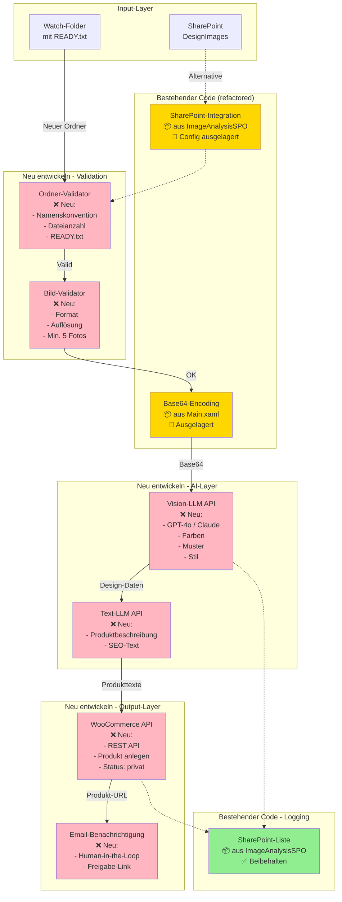

# UC-003: Automatisierte Produktanzeige von Designerstoffen - Technische Analyse

**Analysiert:** 2026-01-05  
**Analyst:** GitHub Copilot  
**Status:** In Bearbeitung  
**Bestandscode vorhanden:** ✅ Ja

---

## 🔴 Offene Rückfragen

> Diese Fragen müssen vor der Implementierung geklärt werden!

### Kritisch (Blockierend)

| # | Frage | Ansprechpartner | Status |
|---|-------|-----------------|--------|
| Q1 | Welche Vision-/Text-KI soll verwendet werden? (GPT-4o, Claude, Grok, On-Prem?) | Sebastian + IT | ⏳ Offen |
| Q2 | API-Zugang zu WooCommerce vorhanden? Welche Authentifizierung? | IT/E-Commerce-Team | ⏳ Offen |
| Q3 | SharePoint-Connection: Produktiv-Environment oder Test? Credentials? | IT | ⏳ Offen |
| Q4 | Datenschutz-Freigabe für Cloud-KI oder muss Vision-LLM On-Prem laufen? | Datenschutzbeauftragter | ⏳ Offen |
| Q5 | Welche Orchestrator-Lizenz? Attended/Unattended? | Sebastian/Lizenz-Verantwortlicher | ⏳ Offen |

### Wichtig (Vor Go-Live klären)

| # | Frage | Ansprechpartner | Status |
|---|-------|-----------------|--------|
| Q6 | Genaue Namenskonvention für Produktordner? Beispiele für alle Varianten? | Sebastian/Shop-Manager | ⏳ Offen |
| Q7 | Textvorlagen und Prompt-Templates für KI-Texterstellung? | Marketing/Content | ⏳ Offen |
| Q8 | Taxonomie für Muster/Farben/Stil - wer pflegt? Wer gibt frei? | Sebastian/Produktmanagement | ⏳ Offen |
| Q9 | Erwartete tägliche/monatliche Produktanzahl? (Dimensionierung) | Sebastian | ⏳ Offen |
| Q10 | Human-in-the-Loop: Wer prüft finale Produkte? Approval-Workflow? | Sebastian/Shop-Team | ⏳ Offen |
| Q11 | Umgang mit Varianten (Farbstellungen)? Einzelprodukt vs. Produktgruppe? | E-Commerce-Team | ⏳ Offen |
| Q12 | WooCommerce CSV-Import vs. REST API? Welche Methode bevorzugt? | IT/E-Commerce | ⏳ Offen |

### Nice-to-have (Kann später geklärt werden)

| # | Frage | Ansprechpartner | Status |
|---|-------|-----------------|--------|
| Q13 | Feedback-Loop: Sollen Korrekturen in Prompt-Verbesserungen fließen? | Produktmanagement | ⏳ Offen |
| Q14 | Automatische SEO-Tag-Generierung gewünscht? | Marketing/SEO | ⏳ Offen |
| Q15 | Monitoring/Dashboard für Verarbeitungsstatus gewünscht? | Sebastian | ⏳ Offen |

---

## 📋 Zusammenfassung des Use Cases

**Verstandener Scope:**
- Automatisierung des Produkt-Onboardings für neue Designerstoffe im WooCommerce-Shop
- KI-gestützte Bildanalyse (Farben, Muster, Stil) und Texterstellung
- Reduktion manueller Schritte von X Stunden auf unter Y Stunden pro Produkt
- Human-in-the-Loop für Qualitätskontrolle und finale Freigabe
- Überwachung eines Watch-Folders mit Marker-Datei (`READY.txt`) als Freigabe-Signal

**Unklare Punkte aus dem README:**
- ❓ Konkrete Zeitangaben (X → Y Stunden) fehlen - Schätzung erforderlich
- ❓ "Ca. 5 Produktfotos" - genaue Anzahl/Varianz? Min/Max?
- ❓ "1-2 Designbilder" - Regel wann 1, wann 2?
- ❓ Metadaten-Fragenkatalog: Existiert bereits oder muss definiert werden?
- ❓ "Vorab manuell bearbeitete Fotos" - welche Bearbeitung genau? (Kontext für Qualitätsprüfung)

---

## 🔍 Analyse bestehender UiPath-Lösung

> **Geprüft:** `assets/uipath-solution/DesignImageFile_1/` (Main.xaml, ImageAnalysisSPO.xaml, project.json)

### Code-Übersicht

**Haupt-Workflows:**

1. **Main.xaml** (319 Zeilen)
   - **Zweck:** Browse für Ordner → Erste Datei aus Ordner auswählen → Base64-Encoding
   - **Hauptfunktionen:**
     - `SelectFolder` - Manueller Folder-Browser (UI-Dialog)
     - `Directory.GetFiles` - Alle Dateien im Ordner holen
     - `strFilesInFolder.First()` - Erste Datei auswählen
     - `Convert.ToBase64String(File.ReadAllBytes())` - Datei als Base64 encodieren
     - `MessageBox` - Debugging-Ausgaben (2x)

2. **ImageAnalysisSPO.xaml** (302 Zeilen)
   - **Zweck:** SharePoint-Integration für Bildanalyse-Workflow (Event-triggered)
   - **Hauptfunktionen:**
     - `NewFileCreated` (Trigger) - Überwacht SharePoint-Ordner "DesignImages"
       - Filter: `ParentID=='01BWB2RALHSTCIOCNSRFCK3LUC7S4NF6I2'`
       - SharePoint: `boutiquefabrics-my.sharepoint.com`
     - `AddListItem` - Fügt Item zu SharePoint-Liste "Produkte" hinzu
       - Liste: `{2F0EC894-8D83-4E7F-842D-8DF16721A333}`
       - Site: `boutiquefabrics.sharepoint.com/sites/Prouktmanagement`

**Dependencies (project.json):**
```json
{
  "UiPath.Excel.Activities": "2.24.4",
  "UiPath.Mail.Activities": "1.24.2",
  "UiPath.MicrosoftOffice365.Activities": "3.4.12",
  "UiPath.System.Activities": "25.10.3",
  "UiPath.Testing.Activities": "24.10.3",
  "UiPath.UIAutomation.Activities": "24.10.10"
}
```

**Studio Version:** 24.10.8.0  
**Project Version:** 1.0.2  
**Target Framework:** Windows  
**Expression Language:** VisualBasic

### Qualitäts-Assessment

#### ✅ Gut umgesetzt

1. **Moderne UiPath-Version**
   - Studio 24.10.8 (aktuell, stabil)
   - Alle Dependencies auf aktuellen Versionen
   - .NET-kompatibel (Windows Target Framework)

2. **SharePoint-Integration**
   - Event-Trigger für neue Dateien (skalierbar)
   - Connection Service konfiguriert
   - Filter-Expression korrekt

3. **Base64-Encoding**
   - Korrekte Implementierung für API-Calls
   - Bereit für Vision-API-Integration

#### ⚠️ Verbesserungsbedarf

1. **Debugging-Code in Produktion**
   - 2x `MessageBox` in Main.xaml
   - **Empfehlung:** Durch `Log Message` ersetzen oder entfernen
   - **Risiko:** Bei unattended Execution → Robot hängt

2. **Fehlende Exception Handling**
   - Kein `TryCatch` in Main.xaml
   - Bei fehlenden Dateien → Crash
   - **Empfehlung:** TryCatch um `Directory.GetFiles` und `.First()`

3. **Hardcoded SharePoint-IDs**
   - Listen-ID und Ordner-ID direkt im XAML
   - **Empfehlung:** In Config-Datei auslagern
   - **Begründung:** Bei Umzug Dev → Test → Prod müssen IDs geändert werden

4. **Keine Validierung der Datei-Anzahl**
   - `strFilesInFolder.First()` nimmt nur erste Datei
   - Bei 0 Dateien → Crash
   - Bei > 1 Bild → Andere werden ignoriert
   - **Empfehlung:** `If strFilesInFolder.Length > 0` + Loop über alle Bilder

5. **Fehlende Marker-Datei-Logik**
   - Kein Check für `READY.txt` (wie im README beschrieben)
   - **Empfehlung:** `File.Exists(Path.Combine(folder, "READY.txt"))` prüfen

6. **Keine Logging-Strategie**
   - Keine `Log Message` Activities
   - **Empfehlung:** Orchestrator-Logging für Monitoring

7. **Typo in SharePoint-Site-URL**
   - `Prouktmanagement` → sollte `Produktmanagement` sein?
   - Falls Typo: IT kontaktieren für Korrektur

#### ❌ Kritische Probleme

1. **Manual Folder Selection (UI-Dialog)**
   - `SelectFolder` öffnet UI-Dialog → **blockiert unattended Robot**
   - **Risiko:** KRITISCH - Prozess kann nicht automatisch laufen
   - **Action:** Ersetzen durch Watch-Folder oder Orchestrator Queue
   - **Lösung:**
     ```vb
     ' Statt SelectFolder:
     strSelectedFolderPath = Config("WatchFolderPath")
     ' Oder: Get Queue Item aus Orchestrator
     ```

2. **Keine Watch-Folder-Implementierung**
   - Use Case beschreibt "Überwachung eines Watch-Folders"
   - Aktuell: Manuelle Auswahl pro Durchlauf
   - **Risiko:** HOCH - Nicht skalierbar
   - **Action:** Implementieren mit `FileSystemWatcher` oder Orchestrator Queue

3. **Fehlende WooCommerce-Integration**
   - Kein Code für Produktanlage in WooCommerce
   - **Action:** REST API-Integration oder CSV-Export implementieren

4. **Fehlende KI-Integration**
   - Keine Vision-API-Calls
   - Keine Textgenerierung
   - **Action:** Vision-LLM-Integration (GPT-4o/Claude) + Prompt-Engineering

5. **Fehlende Namenskonvention-Validierung**
   - Kein Check der Ordnerstruktur
   - **Action:** Regex-Validierung implementieren

### Wiederverwendbare Komponenten

**Übernehmen (mit Refactoring):**
- 🔄 **Main.xaml - Base64-Encoding-Logik**
  - Refactoring: In separaten Workflow `EncodeImageToBase64.xaml` auslagern
  - Input: Dateipfad → Output: Base64-String
  - Wiederverwendbar für alle Bilder (Produktfotos + Designbilder)

- 🔄 **ImageAnalysisSPO.xaml - SharePoint-Integration**
  - Refactoring: SharePoint-IDs in Config auslagern
  - Event-Trigger-Pattern beibehalten (gut für Skalierung)
  - Aber: Erweitern mit Error Handling

**Neu entwickeln (fehlt komplett):**
- ❌ **Watch-Folder-Monitoring** mit `READY.txt`-Check
- ❌ **Namenskonvention-Validator**
- ❌ **Vision-LLM-Integration** (Bildanalyse)
- ❌ **Text-LLM-Integration** (Produkttexte)
- ❌ **WooCommerce-API-Integration**
- ❌ **Metadaten-Parser** (Fragenkatalog-Datei)
- ❌ **Human-in-the-Loop-Benachrichtigung** (Email)

### Empfohlene Refactorings

#### Kurzfristig (vor Go-Live) - KRITISCH

| Prio | Refactoring | Aufwand | Risiko | Beschreibung |
|------|-------------|---------|--------|--------------|
| 🔴 | SelectFolder durch Watch-Folder ersetzen | 1 Tag | Blocking | Unattended Execution unmöglich |
| 🔴 | TryCatch für Exception Handling | 4 Std | Data Loss | Crash bei leeren Ordnern |
| 🔴 | MessageBox durch Log Message ersetzen | 1 Std | Blocking | Robot hängt bei MessageBox |
| 🔴 | SharePoint-IDs in Config | 2 Std | Deployment | Hardcoded Werte nicht portierbar |
| 🔴 | READY.txt-Check implementieren | 2 Std | Fehlerhafte Verarbeitung | Halbfertige Ordner werden verarbeitet |

#### Mittelfristig (MVP-Entwicklung)

| Refactoring | Aufwand | Nutzen |
|-------------|---------|--------|
| Base64-Encoding in separaten Workflow | 4 Std | Wiederverwendbarkeit, Testbarkeit |
| Config-Management (Excel/JSON) | 1 Tag | Wartbarkeit, Env-Management |
| Orchestrator Queue statt Folder-Watch | 2 Tage | Skalierung, Load Balancing |
| Umfassendes Logging (alle Schritte) | 1 Tag | Monitoring, Troubleshooting |
| Unit Tests für Business Logic | 2 Tage | Qualitätssicherung |

#### Langfristig (nach MVP)

| Refactoring | Aufwand | Nutzen |
|-------------|---------|--------|
| REFramework-Pattern implementieren | 1 Woche | Robustheit, Best Practices |
| Performance-Optimierung (Parallel Processing) | 3 Tage | Durchsatz bei hohen Volumina |
| Advanced Error Recovery | 1 Woche | Reduktion manueller Interventionen |

### Code-Quality-Metriken

| Metrik | Aktueller Wert | Benchmark | Status | Empfehlung |
|--------|----------------|-----------|--------|------------|
| Workflows | 2 | < 10 (MVP) | ✅ OK | Wird wachsen mit neuen Features |
| Durchschn. Workflow-Größe | 310 Activities | < 150 | ⚠️ Zu groß | Main.xaml aufteilen |
| TryCatch-Coverage | 0% | > 90% | ❌ Kritisch | **Sofort implementieren** |
| Config-Items hardcoded | 3 | 0 | ❌ Schlecht | In Config auslagern |
| Dependencies veraltet | 0 | 0 | ✅ Aktuell | - |
| UI-Dependencies (unattended) | 2 (SelectFolder, MessageBox) | 0 | ❌ Kritisch | **Blockierend** |
| Logging-Coverage | 0% | > 80% | ❌ Schlecht | Log Message hinzufügen |

---

## 🏗️ Vorläufige Architektur (mit Bestandscode-Integration)



**Legende:**
- 🟡 Gelb: Bestehender Code (refactoring)
- 🔴 Rosa: Neu zu entwickeln
- 🟢 Grün: Bestehender Code (beibehalten)

---

## ⚠️ Identifizierte Risiken

### Technische Risiken

| Risiko | Wahrscheinlichkeit | Impact | Mitigation |
|--------|-------------------|--------|------------|
| **Vision-LLM-Genauigkeit bei komplexen Mustern** | Hoch (60%) | Mittel | Prompt-Engineering + Feedback-Loop |
| **WooCommerce API-Rate-Limits** | Mittel (40%) | Mittel | Batch-Processing + Retry-Logic |
| **SharePoint-Connection-Timeouts** | Mittel (30%) | Niedrig | Retry-Mechanismus |
| **KI-API-Kosten höher als erwartet** | Mittel (50%) | Mittel | Cost-Monitoring + Budget-Alerts |

### Organisatorische Risiken

| Risiko | Wahrscheinlichkeit | Impact | Mitigation |
|--------|-------------------|--------|------------|
| **Keine klare Namenskonvention vorhanden** | Hoch (70%) | Hoch | Workshop mit Shop-Team |
| **Taxonomie für Muster/Farben nicht standardisiert** | Hoch (80%) | Hoch | Taxonomie-Workshop |
| **Datenschutz-Freigabe für Cloud-KI fehlt** | Mittel (40%) | Kritisch | DSGVO-Prüfung + On-Prem-Alternative |

---

## 📅 Empfohlenes Vorgehen

### MVP-Scope (Phase 1) - 6-8 Wochen

**In Scope:**
- ✅ Watch-Folder-Monitoring mit READY.txt
- ✅ Namenskonvention-Validierung
- ✅ Base64-Encoding (aus bestehendem Code)
- ✅ Vision-LLM-Integration (GPT-4o) - Farben, Muster, Stil
- ✅ Text-LLM-Integration (GPT-4o) - Produktbeschreibung
- ✅ WooCommerce REST API
- ✅ Email-Benachrichtigung
- ✅ Orchestrator-Logging

**Out of Scope (MVP):**
- ❌ Varianten-Handling
- ❌ SEO-Tag-Generierung
- ❌ REFramework-Pattern
- ❌ Parallel Processing

### Zeitplan

**Woche 1-2:** Refactoring bestehender Code  
**Woche 3-4:** Watch-Folder + Validation  
**Woche 5-6:** AI-Integration (Vision + Text)  
**Woche 7:** WooCommerce-Integration  
**Woche 8:** Testing & Go-Live

---

## 💡 Fazit zur Bestandscode-Integration

### Positiv

- ✅ **Moderne UiPath-Version** (24.10.8)
- ✅ **~20% des MVP-Codes wiederverwendbar**
- ✅ **SharePoint-Integration funktioniert**

### Kritisch

- ❌ **5 kritische Blocker vor Go-Live** (SelectFolder, MessageBox, Exception Handling, Hardcoded IDs, READY.txt)
- ⚠️ **~80% muss neu entwickelt werden** (AI, WooCommerce, Validation)

### Zeitersparnis

**Geschätzt:**
- Von Grund auf neu: ~10 Wochen
- Mit Bestandscode: ~6-8 Wochen
- **Netto-Ersparnis:** ~2-4 Wochen

### Empfehlung

✅ **Bestehenden Code als Ausgangspunkt nutzen, aber sofort kritische Refactorings durchführen!**

---

**Version:** 1.0  
**Nächste Schritte:**
1. Rückfragen Q1-Q15 klären
2. Workshop: Namenskonvention & Taxonomie
3. API-Zugänge beantragen
4. Entwicklungsstart: Refactoring
