# UC-003: Automatisierte Produktanzeige von Designerstoffen im Webshop – Technische Analyse

Stand: 2025-12-18 (basierend auf aktualisiertem README und neuen Assets)

---

## 🔴 Offene Rückfragen
> Diese Fragen müssen vor der Implementierung (mindestens für das MVP) geklärt werden.

### Kritisch (Blockierend)

| #  | Frage | Ansprechpartner | Status |
|----|--------|-----------------|--------|
| Q1 | Was ist das führende System für Produktstammdaten (Preis, Material, Lagerbestand, Artikelnummer)? Gibt es bereits eine „Single Source of Truth“ (z. B. ERP/WAWi) oder ist WooCommerce aktuell führend? | Business / IT (Shop, ERP) | ✅ Geklärt |
| A1 | **Antwort zu Q1:** Aktuell is das woocommerce und die dort gepflegten Produkte| - | - |
| Q2 | Wie genau sieht die finale, verbindliche Namenskonvention für Produktordner und Dateien aus (Pattern, Pflichtfelder, erlaubte Zeichen)? Die Beispiel-Dateien im assets-Ordner (z. B. `Viskose-Elastan-Jersey-Stoff-0002189-0090024-0000102-5-768x768.jpg`, `Bild1.jpg`–`Bild4.jpg`) und der WooCommerce-Export (`wc-product-export-18-12-2025-1766073940551.csv`) deuten auf ein bestehendes Schema hin – wie sind die einzelnen Segmente (Basisname, Artikelnummer, Farb-/Variantencode, Bildvariante/Größe) fachlich definiert und wie strikt muss dies eingehalten werden? | Shop-Owner / Prozessverantwortliche:r | ⚠️ Teilweise geklärt |
| A2 | **Antwort zu Q2:** die Produktnummer eines produkts ist wie folgt zusammengesetzt: 0002189-0090024-0000102 --> besteht aus Artikelnummer (bspw. Viskose-Elasten in 97/3% - Deisngnummer - Farbnummer) für die Produktordner und Dateinamen können wir uns noch etwas überlegen.  | - | - |
| Q3 | Über welche technische Schnittstelle soll WooCommerce im MVP angebunden werden (REST API, CSV-Import auf Basis der Export-Struktur, Plugin)? Gibt es produktive API-Credentials bzw. ein dediziertes Testsystem? | IT / WooCommerce-Admin | ✅ Geklärt |
| A3 | **Antwort zu Q3:** Es gibt aktuell kein Testsystem, es gibt produktive API-Credentials und den Import können wir via CSV oder RESt machen. Es gibt grosse Bilddateien die hochgeladen werden müssen | - | - |
| Q4 | Welche Vision-/Text-KI dürfen aus Compliance- und Kostensicht verwendet werden (Cloud-Dienste vs. On-Prem/selbst gehostet)? Müssen Bilddaten zwingend on-prem/intern bleiben, oder dürfen Designbilder über einen Cloud-KI-Dienst laufen? | IT Security / Datenschutz / Management | ✅ Geklärt |
| A4 | **Antwort zu Q4:** keine Einschränkungen bezüglich cimpliance, on-prem, intern etc. allerdings sollte es kostengünstig sein. Text KI würde ich ChatGPT mit einem neuen Modell verwenden. Aus ersten Tests hat sich ergeben, dass selbst mit Bild-/Mustererkennung mit LLMs wie ChatGPT am besten und eifachsten ist. | - | - |
| Q5 | Gibt es Limitierungen oder Abhängigkeiten bei Adobe (Lizenzmodell, erlaubte Automatisierung, Headless/CLI-Verwendung), die den automatisierten Start der Photoshop-Stapelverarbeitung durch RPA einschränken? | Design-Verantwortliche / IT | ✅ Geklärt |
| A5 | **Antwort zu Q5:** Nein, aber Adobe/Lightroom haben wir eh ausgeklammert.| - | - |
| Q6 | Wie viele neue Produkte (Designerstoffe) fallen typischerweise pro Woche/Monat an? Daraus ergeben sich Anforderungen an Durchsatz, Batch-Fenster, maximale parallele Läufe und Skalierung der Robots. | Business (Einkauf / Sortiment) | ✅ Geklärt |
| A6 | **Antwort zu Q6:** Es werden zwischen 5-10 pro Woche sein| - | - |

### Wichtig (Vor Go-Live klären)

| #  | Frage | Ansprechpartner | Status |
|----|--------|-----------------|--------|
| Q7 | Welche Felder im WooCommerce-Produkt sind MUSS-Felder für den Go-Live (Titel, Kurzbeschreibung, Beschreibung, Attribute, Variationen, Tags, Kategorien, Meta, Bilder)? Kann der beigefügte WooCommerce-Export als „Referenz-Schema“ für das MVP dienen? | Shop-Owner | ✅ Geklärt |
| A7 | **Antwort zu Q7:** Der beigefügte WooCommerce-Export kann als Referenz dienen | - | - |
| Q8 | Gibt es bereits Text- und SEO-Guidelines (Tonality, Stichworte, Mindestlänge, Struktur), an denen sich die KI-Texte orientieren müssen? Falls nein: sollen aus den bestehenden Produkttexten (Export/Screenshots im assets-Ordner) implizite Regeln abgeleitet werden? | Marketing / Content | ✅ Geklärt |
| A8 | **Antwort zu Q8:** Gibt es noch nicht| - | - |
| Q9 | Sollen Varianten (z. B. unterschiedliche Farbstellungen oder Breiten) bereits im MVP automatisiert angelegt werden oder zunächst nur einfache Produkte ohne Varianten? Wie werden Varianten heute im WooCommerce-Export abgebildet? | Shop-Owner | ✅ Geklärt |
| A9 | **Antwort zu Q9:** Es gibt keine Varianten| - | - |
| Q10 | Welche Sprachen müssen unterstützt werden (nur Deutsch oder DE/EN, ggf. weitere)? Hat Mehrsprachigkeit Priorität im MVP oder kann sie in eine spätere Phase verschoben werden? | Business / Marketing | ✅ Geklärt |
| A10 | **Antwort zu Q10:** Aktuell nur Deutsch | - | - |
| Q11 | Wie soll der Human-in-the-Loop-Prozess genau aussehen (wer prüft, in welchem Tool – direkt im WooCommerce-Backend oder in separaten Formularen –, in welchem Zeitfenster, wie wird Freigabe dokumentiert)? | Fachbereich / Prozessowner | ✅ Geklärt |
| A11 | **Antwort zu Q11:** In einem separaten Formular, entweder über ein Tool wie Powerapps, oder in UiPath gibt es ja auch so ein art Approval Tool wo man Formulare bauen kann | - | - |
| Q12 | Welche Logs und Reports werden benötigt (z. B. Liste neuer Produkte, KI-Confidence, manueller Korrekturaufwand, Durchlaufzeiten, Erkennungsqualität der Muster/Farben)? | Management / Prozessowner | ✅ Geklärt |
| A12 | **Antwort zu Q12:** Die von dir aufgeführten sind ausreichend. | - | - |

### Nice-to-have (Kann später geklärt werden)

| #  | Frage | Ansprechpartner | Status |
|----|--------|-----------------|--------|
| Q13 | Sollen SEO-Tags (Meta-Title, Meta-Description, Keywords) ebenfalls automatisch generiert und gepflegt werden, und falls ja: ausschließlich aus KI oder kombiniert mit fixen Shop-Keywords? | Marketing / SEO | ⏳ Offen |
| A13 | **Antwort zu Q13:** Kann momentan nicht beantwortet werden. | - | - |
| Q14 | Gibt es mittelfristig Pläne für weitere Vertriebskanäle (z. B. Marktplätze, Vergleichsportale), die vom gleichen Produkt-Feed profitieren sollen, sodass das Datenmodell von Anfang an kanalübergreifend gedacht werden sollte? | Management / Vertrieb | ✅ Geklärt |
| A14 | **Antwort zu Q14:** Es wird mit Etsy, Pinterest, Instagram und Facebook synchronisiert.| - | - |
| Q15 | Soll später ein Feedback-Loop implementiert werden, der auf Basis manueller Korrekturen (z. B. im WooCommerce-Backend) Prompts/Modelle verbessert und die Muster-/Stil-Taxonomie iterativ schärft? | IT / Data / Business | ✅ Geklärt |
| A15 | **Antwort zu Q15:** Aktuell noch nicht. | - | - |

## 📋 Zusammenfassung des Use Cases (technische Sicht)

- Ziel ist ein halb- bis weitgehend automatisierter End-to-End-Prozess für das Anlegen neuer Designerstoffe im WooCommerce-Shop.
- Eingang sind von Menschen vorab manuell bearbeitete Produktfotos (Tool-agnostisch, außerhalb dieses Use Cases), 1–2 Designbilder, manuelle Produktstammdaten sowie ein strukturierter Produktordner mit einer Metadaten-Datei, in der der User einen Fragenkatalog mit produktspezifischen Zusatzinformationen beantwortet.
- Der Prozess startet explizit, sobald im Produktordner eine Marker-Datei (z. B. `READY.txt`) angelegt wird – sie trennt klar die manuelle Vorbereitungsphase von der automatisierten Verarbeitung.
- UiPath übernimmt primär die Orchestrierung von Dateioperationen (inkl. Validierung von Struktur und Dateinamen), technische Bildprüfungen (z. B. Format/Größe/Anzahl), Einlesen und Verarbeiten der Metadaten-Datei, KI-Aufrufen (Vision + Text), WooCommerce-Integration (REST/CSV) und Benachrichtigungen.
- KI-Komponenten (Vision-LLM + Text-LLM) liefern Bildanalyse (Farben, Muster, Stil, Saison, Use-Cases, Zielgruppe) und generierte Produkttexte, basierend auf vordefinierten Vorlagen, der Muster-/Stil-Taxonomie aus dem README und den im Fragenkatalog erfassten produktspezifischen Zusatzinformationen.
- Ein Human-in-the-Loop-Schritt stellt sicher, dass Bilder, Attribute und Texte fachlich korrekt sind, bevor das Produkt veröffentlicht wird.

Die im assets-Ordner hinterlegten Ressourcen spielen eine zentrale Rolle für das Design:
- `Bild1.jpg`–`Bild4.jpg` und mehrere `Viskose-Elastan-Jersey-Stoff-...jpg`-Dateien dienen als Referenz für das reale Bildmaterial und die bestehende Dateibenennung.
- Die Screenshots (`Screenshot 2025-12-18 170824.png`, `Screenshot 2025-12-18 170905.png`) liefern Kontext zu aktuellen WooCommerce-Ansichten/Attributen.
- Der WooCommerce-Export `wc-product-export-18-12-2025-1766073940551.csv` zeigt die reale Feld- und Attributstruktur im Shopsystem und sollte als Grundlage für das Ziel-Datenmodell im MVP dienen.

Unklar bzw. noch zu verfeinern sind aktuell vor allem: die finale, formal dokumentierte Namenskonvention für Produktordner und Dateien (Q2), die konkrete SEO-/Keyword-Strategie inkl. automatischer SEO-Texte (Q8, Q13), die genaue Ausgestaltung des kanalübergreifenden Datenmodells für weitere Vertriebskanäle (Q14) sowie der Zeitpunkt und die Ausprägung eines möglichen Feedback-Loops (Q15).

---

## 🏗️ Vorläufige Architektur

### Empfohlenes Pattern

- Orchestrierung mit REFramework (oder Agentic-Variante), um Datei-Trigger, Validierung, KI-Aufrufe und WooCommerce-Schritte als robuste Transactions abzubilden.
- UiPath als „Klammer“ um:
  - Dateisystem / Watch-Folder inklusive Marker-Datei `READY.txt` als Trigger,
  - Validierung und technische Prüfung der bereitgestellten Bilder,
  - KI-Services (Vision + Text),
  - WooCommerce API/CSV-Schnittstelle,
  - Benachrichtigung (E-Mail / Teams / Slack) für Human-in-the-Loop.

### High-Level-Flow (Mermaid)

```mermaid
graph TD;
  A[Watch-Folder überwachen<br/>Produktordner mit READY.txt erkennen];
  B[Produktordner validieren<br/>Struktur & Dateinamen prüfen];
  C[Technische Bildprüfung<br/>Format, Auflösung, Mindestanzahl prüfen];
  D[Human Bild- und Datenkontrolle<br/>Produktstammdaten ergänzen/prüfen];
  E[Agent Vision-KI<br/>Designbilder analysieren<br/>Farben, Muster, Stil, Merkmale];
  F[Agent Text-KI<br/>Produkttexte generieren];
  G[RPA Produkt in WooCommerce anlegen<br/>Status: privat];
  H[RPA URL an verantwortliche Person senden];
  I[Human finale Freigabe<br/>Veröffentlichung im Shop];
  K[Logging und Reporting<br/>Orchestrator-Logs und KPI-Logs];

  A --> B;
  B --> C;
  C --> D;
  D --> E;
  E --> F;
  F --> G;
  G --> H;
  G --> K;
  H --> I;
```

> Hinweis: In den Mermaid-Knotenbeschriftungen werden bewusst keine runden Klammern `()` verwendet, da diese in einigen Renderern (z. B. Markdown-Preview in bestimmten Setups) zu Problemen führen können.

### Systemübersicht

- **UiPath Orchestrator / Robots**: zentrale Steuerung, Queue-Handling, Logging, Retry-Strategien.
- **File Storage / Watch-Folder**: Wurzelverzeichnis für Produktordner; Marker-Datei `READY.txt` dient als expliziter Prozess-Trigger.
- **Vorgelagerte manuelle Bildbearbeitung**: erfolgt außerhalb dieses Use Cases (Tool-agnostisch, z. B. Lightroom, Photoshop oder andere Werkzeuge) und liefert fertig bearbeitete Produktfotos in den Watch-Folder.
 - **Führendes Stammdatensystem**: WooCommerce fungiert im MVP als führendes System für Produktstammdaten; ein separates ERP/WAWi wird aktuell nicht angebunden.
- **Vision-LLM**: via HTTP-API (REST) angebunden; Input = Designbilder, Output = strukturierte Beschreibung (Farben/Hex, Mustertyp, Stil, Saison, Use-Cases, Zielgruppe) gemappt auf die im README definierte Taxonomie.
- **Text-LLM**: via HTTP-API; bevorzugt wird ein kostengünstiger Cloud-Dienst (z. B. ChatGPT) verwendet; Input = Vision-Output + Produktstammdaten + Textvorlagen; Output = Titel, Kurzbeschreibung, Beschreibung, Meta-Texte.
- **WooCommerce**: bevorzugt via REST-API (für Anlage/Update von Produkten, Bildern, Attributen); alternativ/ergänzend CSV-Import basierend auf der Struktur des vorhandenen Exports.
- **Benachrichtigungssystem**: E-Mail oder Collaboration-Tool für Human-in-the-Loop-Schritte (Review, Freigabe).

Die Assets (Bilder, Screenshots, Export-CSV) können für frühe End-to-End-Tests und das Mapping der Felder/Attribute verwendet werden.

---

## ⚠️ Identifizierte Risiken

- **KI-Qualität bei Muster-/Stilerkennung**: Vision-LLMs können bei komplexen oder gemischten Motiven (z. B. Mischungen aus Blumen, Geometrie und Tieren) unklare Zuordnungen treffen.
  - Gegenmaßnahmen: Confidence-Schwellen, Möglichkeit für manuelle Korrektur der Tags, Logging der KI-Vorschläge, spätere Feinjustierung der Taxonomie.
- **Abhängigkeit von Drittdiensten (KI)**: Cloud-KI-APIs können Latenz- und Verfügbarkeitsprobleme oder Kostenspitzen verursachen.
  - Gegenmaßnahmen: Rate-Limits berücksichtigen, Fallback-Strategien (Retry, Degradation auf „Minimaltexte“), Kosten-Monitoring.
- **Qualität der vorgelagerten Bildbearbeitung**: Schlechte oder inkonsistente manuelle Bildbearbeitung (z. B. Belichtung, Zuschnitt) kann die KI-Analyse und Wahrnehmung im Shop beeinträchtigen.
  - Gegenmaßnahmen: klare Guidelines für Bildbearbeitung, Stichprobenkontrollen, Rückmeldeschleifen an verantwortliche Personen.
- **Daten- und IP-Schutz**: Designerstoffe sind IP-kritisch; Nutzung von Cloud-KI für Bilder muss datenschutzrechtlich und vertraglich geklärt werden.
  - Gegenmaßnahmen: Klare Vorgaben, ob Designbilder extern verarbeitet werden dürfen; ggf. nur Text-/Meta-Daten in die Cloud geben.
- **WooCommerce-Varianten & Datenmodell**: Varianten (z. B. Farbstellungen, Breiten) können in WooCommerce komplex werden; der bestehende Export muss sauber interpretiert werden.
  - Gegenmaßnahmen: MVP zunächst auf einfache Produkte begrenzen; Varianten-Handling in spätere Phase verschieben.
- **Change Management & Akzeptanz**: Shop-Manager:innen und Designer:innen müssen Vertrauen in KI-Texte und -Analyse aufbauen.
  - Gegenmaßnahmen: Transparente KPIs, Review-Prozess, Möglichkeit zur einfachen Korrektur; spätere Nutzung dieser Korrekturen für Feedback-Loop.

---

-## 🔧 Vorläufige technische Details

- **Trigger & Queues**:
  - Datei-basierter Trigger über Watch-Folder: Jeder Produktordner mit Marker-Datei `READY.txt` wird als neue Transaction in einer Orchestrator-Queue erfasst (Queue „UC-003-ProductOnboarding“ o. ä.).
  - Jede Transaction repräsentiert genau einen Stoff (inkl. Bilder & Stammdaten), identifiziert über Ordnername/Artikelnummer.
- **Dateistruktur & Validierung**:
  - Produktordner enthält: vorbereitete Produktfotos, Designbilder, eine Metadaten-Datei mit Antworten auf den produktspezifischen Fragenkatalog (z. B. CSV/JSON/Excel) sowie `READY.txt`.
  - RPA validiert anhand der definierten Namenskonvention (aus README + Assets), ob alle benötigten Dateien (inkl. Metadaten-Datei) vorhanden und korrekt benannt sind.
- **Vorgelagerte Bildbearbeitung (manuell)**:
  - Die kreative und technische Bildbearbeitung (z. B. Zuschnitt, Farbkorrektur) findet außerhalb dieses Use Cases durch Menschen mit frei wählbaren Tools statt.
  - Der RPA-Prozess geht davon aus, dass die in den Produktordnern abgelegten Bilder bereits final für den Webshop vorbereitet sind und führt selbst keine Adobe- oder andere Bildbearbeitungs-Automatisierung durch.
- **Vision-KI-Integration**:
  - HTTP Request Activity zu Vision-LLM.
  - Pro Designbild wird ein strukturierter JSON-Output zurückgeliefert (Farben [Hex + sprechende Namen], Mustertyp, Stil, optionale Merkmale wie Saison/Use-Cases/Zielgruppe).
  - Mapping der KI-Ausgaben auf die im README definierte Taxonomie (z. B. Blumen, Streifen, Animal-Print, verspielt, elegant, boho etc.).
- **Text-KI-Integration**:
  - Prompts werden als versionierte Dateien (z. B. unter `knowledge/custom/` oder `templates/`) gepflegt.
  - Input: Vision-Output + Produktstammdaten (z. B. aus Metadaten-Datei oder später aus ERP) + Style-Guidelines.
  - Output: Titel, Kurz- und Langbeschreibung, optional Meta-Description und Bullet Points.
- **WooCommerce-Anbindung**:
  - Variante A (bevorzugt): REST-API – direkter Upload von Bildern, Setzen von Attributen, Kategorien, Tags und Texten.
  - Variante B: CSV-Import – RPA generiert eine CSV-Zeile pro Produkt nach dem Schema des vorhandenen Exports und stößt den Backend-Import an.
- **Logging & Auditing**:
  - Orchestrator-Logs für jeden Prozessschritt.
  - Zusätzlich strukturierte Logs (z. B. JSON/CSV) pro Produkt mit KI-Output (Vision + Text), Prozessdauer, Fehlern und manuellem Korrekturaufwand.
- **Human-in-the-Loop**:
  - Versand einer E-Mail oder Nachricht mit Link zum „privaten“ Produkt im WooCommerce-Backend.
  - Review und Freigabe erfolgen über ein separates Formular, z. B. als UiPath Form oder alternativ als Power Apps Lösung – inklusive strukturierter Checkliste für Feedback (Korrekturen an Farben, Mustern, Texten).

---

## 📅 Empfohlenes Vorgehen (MVP)

### Phase 1 – Discovery & Datenbasis

- Feinjustierung der noch offenen bzw. teilweise geklärten Punkte, insbesondere: finale Namenskonvention für Produktordner/Dateien (Q2), SEO-/Keyword-Strategie und Umgang mit automatischen SEO-Tags (Q8, Q13), kanalübergreifendes Datenmodell für weitere Vertriebskanäle (Q14) sowie möglicher Feedback-Loop (Q15).
- Analyse des WooCommerce-Exports `wc-product-export-18-12-2025-1766073940551.csv` zur Ableitung des Ziel-Datenmodells (MUSS-/KANN-Felder) für einfache Produkte ohne Varianten.
- Review der aktuellen Produktseiten und Screenshots im assets-Ordner zur Ableitung impliziter Text-/SEO-Regeln, solange keine formalen Guidelines existieren.
- Finalisierung der Ordner- und Dateinamenkonvention sowie des Marker-Datei-Konzepts (`READY.txt`).

### Phase 2 – Technischer MVP (ohne oder mit minimaler KI)

- Implementierung eines stabilen RPA-Basisszenarios:
  - Watch-Folder + `READY.txt`-Trigger → Queue-Befüllung.
  - Validierung der Ordnerstruktur und Dateinamen.
  - Technische Prüfung der Bilder (Formate, Auflösung, Mindestanzahl) und Upload der gelieferten Bilder nach WooCommerce.
  - Anlage eines Produkts als „privat“ mit Grunddaten (Titel/Platzhaltertexte) und Bildern.
- Ziel: Messbarer, robuster End-to-End-Prozess für 1–2 Beispielprodukte aus dem assets-Ordner.

### Phase 3 – KI-Integration (Vision + Text)

- Anbindung eines Vision-LLM und Test der Muster-/Farberkennung auf den Beispielbildern aus dem assets-Ordner.
- Entwurf und Versionierung von Prompt-Templates für die Text-KI.
- Evaluierung der Ergebnisqualität mit realen Stoffen; Definition von Regeln, wann Human-Review verpflichtend ist (z. B. niedrige Confidence, ungewöhnliche Musterkombinationen).

### Phase 4 – Human-in-the-Loop & Härtung

- Detaillierte Ausgestaltung des Review-/Freigabeprozesses (Personen, Tools, SLAs).
- Aufbau eines einfachen Reporting-Dashboards (z. B. über Orchestrator-Logs oder zusätzliche Datenhaltung) für Durchlaufzeiten, KI-Qualität und manuelle Eingriffe.
- Implementierung robuster Fehler- und Retry-Strategien (z. B. bei API-Fehlern, Adobe-Ausfällen).

---

## 📊 Vorläufige Metriken / KPIs

- **Durchlaufzeit pro Produkt**: Zeit von `READY.txt` im Watch-Folder bis „Produkt privat in WooCommerce angelegt“.
- **Automatisierungsgrad**: Anteil der Produkte, die ohne inhaltliche Korrektur der KI-Texte und -Analysen veröffentlicht werden können.
- **KI-Qualität**:
  - Akzeptanzquote der Vision-Analyse (Farben, Muster, Stil, Saison, Use-Cases) durch Fachexperten.
  - Akzeptanzquote der KI-generierten Texte (Bewertungsskala, z. B. 1–5).
- **Fehlerquote WooCommerce-Integration**: Anzahl fehlgeschlagener Produktanlagen / Gesamtanlagen.
- **Manueller Aufwand**: durchschnittlicher Zeitaufwand pro Produkt im Human-in-the-Loop-Schritt.
- **Prozessstabilität**: Anzahl technischer Fehler pro X Produkte (z. B. API-Fehler, Timeouts).

Diese KPIs sollten bereits in der MVP-Phase mitgeloggt und ausgewertet werden, um den Nutzen des Use Cases gegenüber dem heutigen Prozess transparent und messbar zu machen.