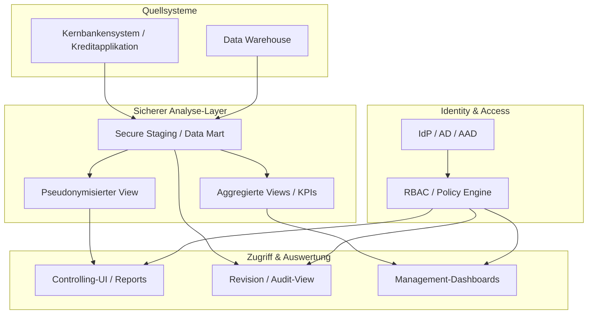

# UC-004: Covid-Kredite Monitoring & Datensicherheit - Technische Analyse

**Related Use Case:** [README.md](./README.md)  
**Erstellt:** 2025-12-23  
**Status:** Analyse (Rückfragen offen)

---

## 🔴 Offene Rückfragen

> **Diese Fragen müssen vor der konkreten Lösungsarchitektur und Implementierung geklärt werden!**

### Kritisch (Blockierend)

| # | Frage | Ansprechpartner | Status |
|---|-------|-----------------|--------|
| Q1 | Welche konkreten rechtlichen Grundlagen / Weisungen (Bund, Aufsicht, interne Policies) gelten für diesen Use Case? | Datenschutzbeauftragter / Legal / Compliance | ⏳ Offen |
| Q2 | Wo liegen die Covid-Kreditdaten heute physisch (Systeme, Rechenzentren, Cloud-Regionen)? | IT / Fachbereich Datenverantwortliche | ⏳ Offen |
| Q3 | Welche Vorgaben gibt es zur Datenresidenz (nur CH, CH/EU?) und zu Verschlüsselung / Key-Management (HSM, KMS, eigene Keys)? | IT-Security / Architektur / Legal | ⏳ Offen |
| Q4 | Welche Rollen sollen in der Zielarchitektur existieren (z.B. Controlling, Revision, Spezialisten, Management) und welche Sichten/Rechte hat jede Rolle genau? | Fachbereich + Datenschutz + IT-Security | ⏳ Offen |
| Q5 | Dürfen identifizierende Einzeldaten ausserhalb der Kernsysteme/Bankenplattform gespeichert werden (z.B. in separatem Reporting-Store), und wenn ja, unter welchen Bedingungen? | IT-Security / Architektur / Datenschutz | ⏳ Offen |
| Q6 | Gibt es bereits zentrale Logging-/SIEM- und DLP-Lösungen, an die die neue Lösung angeschlossen werden muss (z.B. Splunk, Sentinel, M365 DLP)? | IT-Security | ⏳ Offen |

### Wichtig (Sollte vor Go-Live geklärt sein)

| # | Frage | Ansprechpartner | Status |
|---|-------|-----------------|--------|
| Q7 | Welche bestehenden Reporting-/Analytics-Plattformen sollen bevorzugt genutzt werden (Power BI, internes Data Warehouse, eigenes Portal, UiPath Apps, etc.)? | IT-Architektur / BI-Team | ⏳ Offen |
| Q8 | Wie oft müssen die Daten aktualisiert werden (Near-Real-Time vs. täglich/monatlich)? | Fachbereich | ⏳ Offen |
| Q9 | Welche Exportmöglichkeiten sind zwingend erforderlich (z.B. CSV für Revision) und welche sollen technisch unterbunden oder nur nach Freigabe erlaubt sein? | Fachbereich + Revision + Datenschutz | ⏳ Offen |
| Q10 | Wie lange müssen die Auswertungsdaten und Audit-Logs aufbewahrt werden (gesetzliche Aufbewahrungsfristen)? | Legal / Compliance | ⏳ Offen |
| Q11 | Gibt es Anforderungen an Pseudonymisierung/Anonymisierung für bestimmte Sichten (z.B. Management) und wie wird der Schlüssel verwaltet? | Datenschutz / IT-Security | ⏳ Offen |

### Nice-to-have (Kann später geklärt werden)

| # | Frage | Ansprechpartner | Status |
|---|-------|-----------------|--------|
| Q12 | Sollen weitere kritische Datendomänen (z.B. andere Förderprogramme, sensible Kundensegmente) langfristig über dieselbe Blaupause angebunden werden? | Fachbereich / Strategie | ⏳ Offen |
| Q13 | Gibt es Anforderungen an Self-Service-Analytics für berechtigte Power-User? | BI-Team / Fachbereich | ⏳ Offen |
| Q14 | Sollen Alerts/Benachrichtigungen (z.B. bei Schwellenwerten oder Datenanomalien) in ein bestehendes Incident- oder Ticket-System integriert werden? | IT-Security / Operations | ⏳ Offen |

---

## 📋 Zusammenfassung des Use Cases (technische Sicht)

### Verstandener Scope

Basierend auf dem README verstehe ich Folgendes:

- **Dateninhalt:** Einzelne Firmen mit Covid-Krediten, inkl. Beträgen, Rückzahlungsstatus, Ausfällen, zeitlichem Verlauf.
- **Sensitivität:** Hoch bis sehr hoch (kritisch); politisch und medial heikel, mit erhöhtem Reputations- und Compliance-Risiko.
- **Ziel:** Sichere Bereitstellung von Analysen/Reports für klar definierte Rollen, mit strengen Datenschutz- und Sicherheitsvorgaben.
- **Blaupause:** Die Architektur soll später für weitere kritische Mini-Tender wiederverwendet werden (generisches Sicherheits-Pattern).

### Unklare Punkte aus dem README

| Thema | Im README | Was fehlt |
|-------|-----------|-----------|
| Rechtliche Vorgaben | "Datenschutzvorgaben Bund" | Konkrete Gesetze/Verordnungen, interne Policies, Spezialvorgaben |
| Datenquellen | nur abstrakt erwähnt | Konkrete Systeme, Schnittstellen, Datenflüsse |
| Rollenmodell | nur high-level Rollenideen | Exakte Berechtigungsmatrix pro Rolle und Ansicht |
| Plattform | nicht spezifiziert | Zielarchitektur (on-prem, Cloud, hybride) und bevorzugte Tools |
| Export / DLP | "Daten dürfen nicht nach aussen" | Konkrete Definition, was verboten, was kontrolliert, was erlaubt ist |

---

## 🏗️ Vorläufige Architektur (Blaupause)

> Hinweis: Diese Architektur ist ein **Entwurf** und hängt von den Antworten auf die kritischen Fragen ab.

### Architektur-Idee

- Trennung zwischen **operativen Systemen**, **sicherem Analyse-/Reporting-Layer** und **Zugriffs- & Governance-Schicht**.
- Striktes **Role-Based Access Control (RBAC)** mit Integration in bestehendes Identity Management.
- Durchgängige **Verschlüsselung** (at rest & in transit) und minimierte Datenkopien.
- Zentrales **Audit Logging** aller sicherheitsrelevanten Aktionen.

### Systemanbindung (vorläufig)

| Bereich | System/Komponente | Rolle |
|--------|--------------------|-------|
| Quelle | Kernbankensystem / DWH | Liefert Covid-Kreditdaten (idealerweise via gesicherten ETL/ELT-Prozess) |
| Secure Zone | Isolierter Data Mart / Secure Analytics Environment | Hält minimal notwendige Datensätze für Auswertung, verschlüsselt und streng zugriffsbeschränkt |
| Zugriff | Reporting-Tool (z.B. Power BI on-prem/embedded, internes Portal) | Darstellung der Sichten pro Rolle |
| IAM | AD/AAD/IdP, evtl. PAM | Authentisierung, Autorisierung, privilegierte Zugänge |
| Security | SIEM, DLP, zentrale Logplattform | Überwachung, Anomalieerkennung, Audit |

---

## ⚠️ Identifizierte Risiken

### Technische Risiken

| Risiko | Wahrscheinlichkeit | Impact | Mitigation (Entwurf) |
|--------|-------------------|--------|----------------------|
| Daten werden in zu vielen Kopien gehalten | Mittel | Hoch | Minimierung von Kopien, klare Data Lineage, nur ein "Secure Data Mart" für kritische Daten |
| Unklare Datenresidenz / Cloud-Einsatz | Mittel | Hoch | Entscheidung zu Hosting-Standorten und -Modellen vor Architektur-Finalisierung (Q2, Q3) |
| Falsche oder zu breite Berechtigungen | Mittel | Hoch | Strenges RBAC, Vier-Augen-Prinzip bei Rollenvergabe, regelmässige Rezertifizierung |
| Fehlende Integration in bestehende Security-Tools | Mittel | Mittel/Hoch | Frühe Abstimmung mit IT-Security, Anbindung an SIEM/DLP (Q6) |
| Performance-Probleme bei grossen Datenmengen | Niedrig/Mittel | Mittel | Geeignete Storage- und Index-Strategie, Voraggregation |

### Organisatorische Risiken

| Risiko | Beschreibung | Mitigation |
|--------|--------------|-----------|
| Stakeholder haben unterschiedliche Sicherheits-Erwartungen | z.B. Fachbereich vs. Datenschutz vs. IT-Security | Gemeinsamer Workshop, abgestimmtes Sicherheitszielbild |
| Fehlende klare Data Owner | Unklar, wer fachlich für Datenverarbeitung verantwortlich ist | Data Ownership definieren (Fachbereich, Legal, IT) |
| Zeitdruck durch Mini-Tender | Gefahr von "Quick & Dirty"-Lösungen | MVP klar definieren, aber Sicherheitsanforderungen nicht aufweichen |

---

## 🔧 Vorläufige technische Details

### Zugriff & Identität

- Integration mit bestehendem Identity Provider (AD / AAD / kundenspezifischer IdP).
- **MFA** verpflichtend für alle Nutzer mit Zugriff auf identifizierende Covid-Kreditdaten.
- RBAC mit klaren Rollen (Entwurf):
  - `CovidCredit_Controller`: Vollzugriff auf Detaildaten, keine Administration.
  - `CovidCredit_Auditor`: Zugriff auf alle Daten + Audit-Logs (Read-only).
  - `CovidCredit_Admin`: Technische Administration; kein oder nur stark eingeschränkter Zugriff auf Inhalte (Trennung von Admin und Fachrolle).
  - `CovidCredit_Management`: Zugriff nur auf aggregierte/anonymisierte Sichten.

### Datenhaltung & Verschlüsselung

- **Encryption at Rest** für alle Speicher, die Covid-Kreditdaten enthalten (DB, Files, Backups).  
- **Encryption in Transit** via TLS für sämtliche Verbindungen (Quellen → Secure Zone → Reporting).
- Klärung, ob Kundenseitig ein HSM/KMS vorhanden ist (z.B. Hardware Security Module, Cloud KMS) und ob **Customer-Managed Keys** verwendet werden müssen (Q3).

### Pseudonymisierung / Anonymisierung

- Pseudonymisierte Views für Rollen, die keine direkten Identifikatoren benötigen (z.B. gehashte Firmennamen, entfernte IDs).
- Optionale Anonymisierung/Aggregation für Management-Reports (nur Branchen-/Regionen-Kennzahlen, keine Einzelobjekte).
- Schlüsselverwaltung und Rückführbarkeit (wer darf eine Pseudonymisierung auflösen?) sind mit Datenschutz/IT-Security abzustimmen (Q11).

### Logging & Monitoring

- Zentrales Audit-Log für:
  - erfolgreiche und fehlgeschlagene Logins
  - Zugriffe auf Detailansichten ("Wer hat welche Firma wann betrachtet?")
  - Exporte/Downloads mit Metadaten (User, Umfang, Zeitpunkt)
  - Rollenänderungen und Admin-Aktionen
- Anbindung an bestehendes SIEM (z.B. Korrelationsregeln für verdächtige Aktivitäten, Massenexporte, unübliche Zugriffe).

### Exporte & Data Loss Prevention

- Standard: Keine unkontrollierten Rohdaten-Exporte.  
- Zulässige Exporte nur:
  - in pseudonymisierter/aggregierter Form, oder
  - nach explizitem Freigabeprozess (z.B. für Revision).
- Prüfung, ob bestehende DLP-Lösungen (z.B. M365 DLP) eingesetzt werden können, um z.B. Weitergabe via E-Mail/Teams zu überwachen oder zu verhindern.

---

## 📅 Empfohlenes Vorgehen

### Phase 1: Klarstellung Rahmenbedingungen (1–2 Workshops)

- Klärung aller **kritischen Fragen** (Q1–Q6) mit Datenschutz, IT-Security, Architektur, Fachbereich.
- Definition von Data Ownership, Rollenmodell und Zielplattform.
- Dokumentation eines ersten Security- und Datenschutzkonzepts (hohes Level) für diesen Use Case.

### Phase 2: Architektur-Blueprint & MVP-Design

- Ausarbeitung einer **konkreten Referenzarchitektur** (inkl. Datenflüsse, RBAC-Modell, Logging-Konzept).
- Definition eines **MVP-Scopes**, z.B.:
  - nur ein Teil der Covid-Kreditdaten (Pilot-Subset)
  - Fokus auf sichere Bereitstellung von Reports für eine Rolle (z.B. Controlling)
  - strikte Limitierung der Export-Funktionalität.

### Phase 3: Umsetzung MVP

- Aufbau/Erweiterung der Secure Zone und Anbindung der relevanten Datenquellen.
- Umsetzung RBAC, Logging und Basissichten.
- Technische und fachliche Tests inkl. Security-Review.

### Phase 4: Erweiterung & Generalisierung

- Erweiterung auf zusätzliche Rollen/Sichten (Revision, Management).
- Dokumentation der Architektur und Sicherheitsmassnahmen als **übertragbare Blaupause** für weitere kritische Mini-Tender.

---

## 📊 Vorläufige Metriken

| KPI | Zielrichtung | Beispiel |
|-----|-------------|----------|
| Anzahl unautorisierter Zugriffsversuche | So gering wie möglich, automatisiert detektiert | Monitoring über SIEM, Alarm bei Mustern |
| Time-to-Detect verdächtige Aktivitäten | Stunden statt Tage/Wochen | definierte Alert-Rules im SIEM |
| Abdeckung der Zugriffe im Audit-Log | 100 % aller sicherheitsrelevanten Aktionen | technische Tests & Audits |
| Aufwand für Erstellung von Standard-Reports | Deutlich reduziert vs. manuell | Fachbereichs-Feedback |
| Wiederverwendbarkeit der Architektur | Blaupause in mind. 1–2 weiteren kritischen Use Cases nutzbar | Referenzprojekte |

> Diese Metriken sind Vorschläge und müssen mit Fachbereich, IT-Security und Compliance abgestimmt werden.

---

## 🔗 Nächste Schritte

- Beantwortung der **kritischen Fragen (Q1–Q6)** gemeinsam mit Datenschutz, IT-Security, Architektur und Fachbereich.
- Entscheidung über Zielplattform und Datenresidenz.
- Ausarbeitung einer detaillierten Architektur (ggf. als ADR im Projekt, z.B. "UC-004 Covid-Kredite Security Architecture").
- Vorbereitung von Unterlagen (Architekturdiagramm, TOM-Übersicht), die im Mini-Tender als Sicherheits-Blaupause präsentiert werden können.
